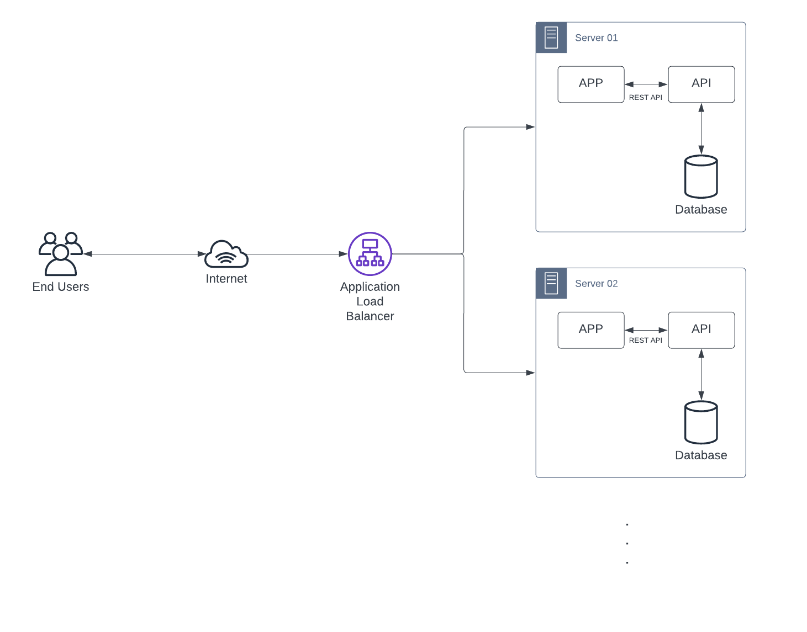
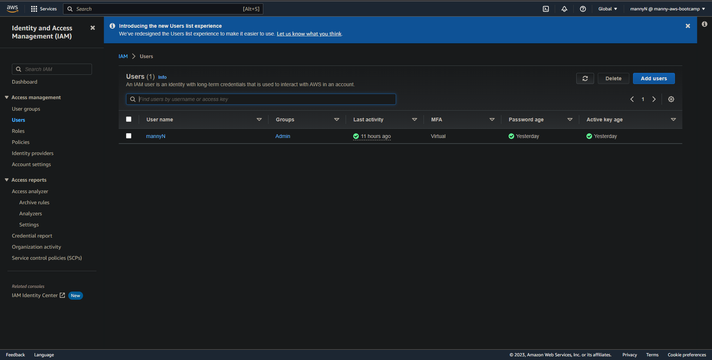
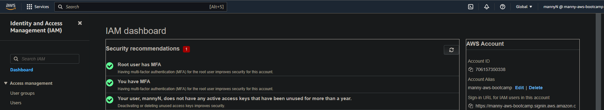
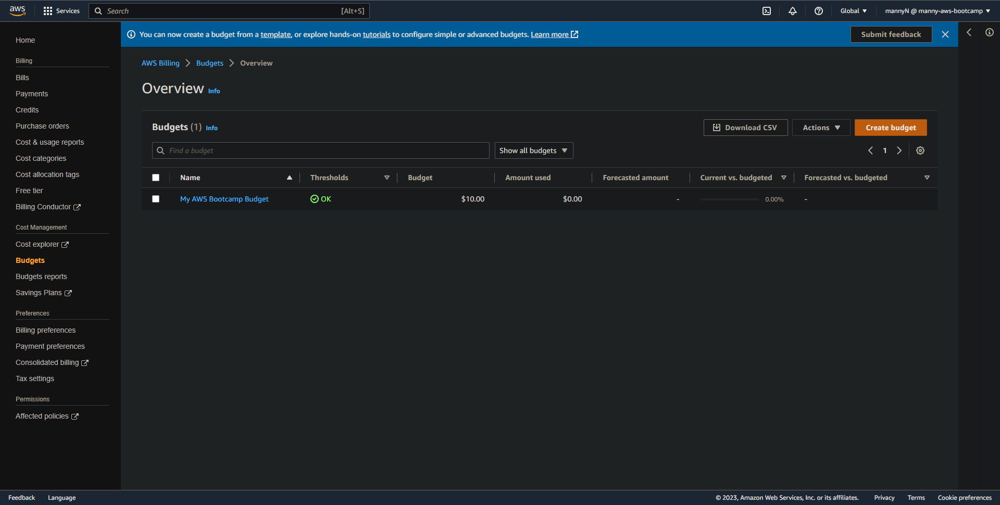
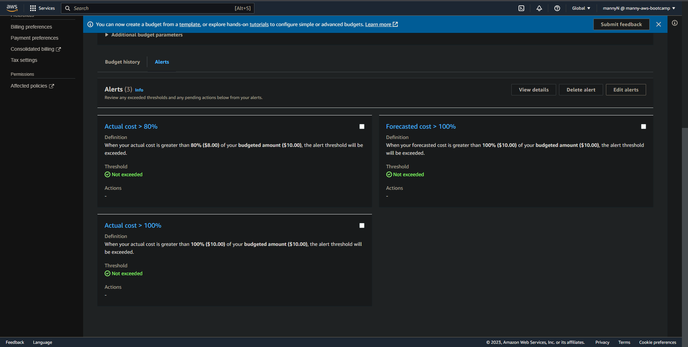
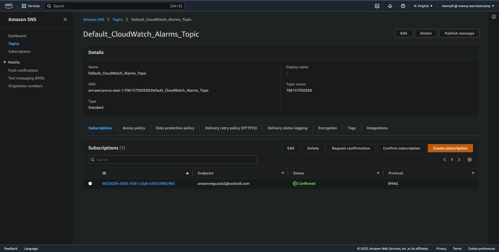
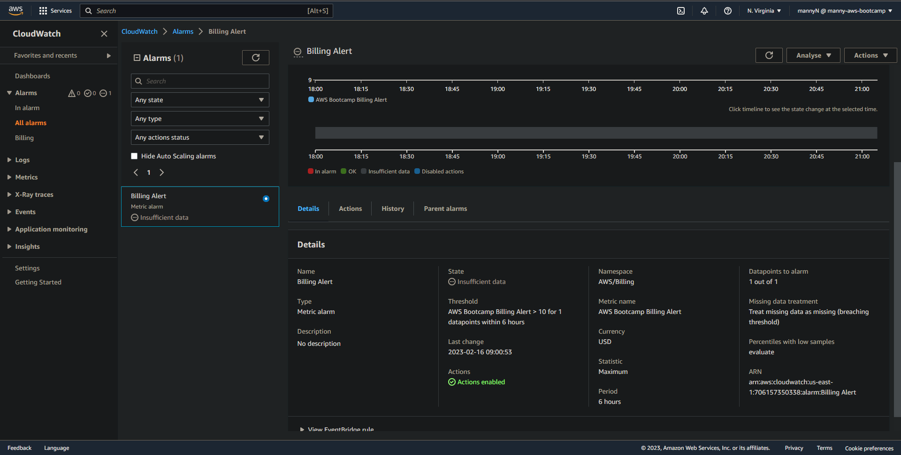

# Week 0 — Billing and Architecture
- In this week, we learnt about a variety of technologies to progress with our cloud knowledge. Some of the things we learnt includes: 
    * How to design diagrams using napkins as well as architectural diagrams of what we plan to build
    * How to use Lucid Charts to build architectural designs
    * About C4 Models
    * Look-through the cloud services we utilize
    * Setting up AWS free-tier and understand how to track spend in AWS (AWS Budgets, AWS Cost Explorer, Billing Alarms)
    * Understanding how to look at monthly billing reports
    * Launching AWS CloudShell and looking at AWS CLI
    * Generating AWS credentials

## Required Homework/Tasks
- To test if we grasped the concepts provided to us through the meeting as well as the provided videos to aid us, we were given homeworks. They are:
    - [X] Create an architectural diagram (to the best of your ability) the CI/CD logical pipeline in Lucid Charts.
    - [X] Setting an IAM role and securing it with MFA.
    - [X] Use EventBridge to hookup Health Dashboard to SNS and send notification when there is a service health issue.
    - [] Review all the questions of each pillars in the Well Architected Tool (No specialized lens).
    - [] Research the technical and service limits of specific services and how they could impact the technical path for technical flexibility. 
    - [] Open a support ticket and request a service limit.

- I will describe my work and the process I overcame in the order provided above.

### Conceptual, Architectural(Logical) Diagrams

- The Conceptual (Napkin) Design I did looks like this. I know it isn't much, but hey, it's honest work :)


[Conceptual Diagram - Lucid Charts](https://lucid.app/lucidchart/ae2dab9c-3331-4b0a-b610-26a5be45672c/edit?viewport_loc=-216%2C-198%2C2720%2C1358%2CwcSxugjtXe~j&invitationId=inv_ce17d7f5-4aed-45ef-97a5-4e0fb7813844)

- The Logical Diagram for the application is shown below. I used the one given as an example and redesigned it a bit according to the [formatting powerpoint documentation by AWS.](https://media.amazonwebservices.com/architecturecenter/icons/AWS_Simple_Icons_ppt.pptx)

.png)
[Logical Diagram (Application) - Lucid Charts](https://lucid.app/lucidchart/ae2dab9c-3331-4b0a-b610-26a5be45672c/edit?viewport_loc=-5%2C-1039%2C1929%2C963%2C0_0&invitationId=inv_ce17d7f5-4aed-45ef-97a5-4e0fb7813844)

- The Logical Diagram I came up for the CI/CD pipeline is shown below. I'd like to improve this diagram when we further push into this course :)

.png)
[Logical Diagram (CI/CD) - Lucid Charts](https://lucid.app/lucidchart/ae2dab9c-3331-4b0a-b610-26a5be45672c/edit?viewport_loc=-191%2C153%2C2158%2C1077%2Cx_JxpN-KF3Eh&invitationId=inv_ce17d7f5-4aed-45ef-97a5-4e0fb7813844)

----------------------

### Setting an IAM role and securing it with MFA

- To set up the IAM role, I followed the steps provided in the video demonstrated by [Andrew Brown](https://www.youtube.com/watch?v=OdUnNuKylHg&list=PLBfufR7vyJJ7k25byhRXJldB5AiwgNnWv&index=14) on YouTube. The user I created is shown below.



- For both the IAM user and the root user, I set up MFA to strengthen the security of my AWS account. The proof is shown below.



-----------------------------------------

### Create a Cost and Usage budget

- I previously used the tutorial provided by [Chirag](https://youtu.be/OVw3RrlP-sI?list=PLBfufR7vyJJ7k25byhRXJldB5AiwgNnWv), But I had to remove that budget from my account because I was concerned of budget spending going over the free limit. The following command was used to create a Cost and Usage budget using the AWS CLI in my GitPod environment.
```
aws budgets create-budget \
    --account-id $AWS_ACCOUNT_ID \
    --budget file://aws/json/budget.json \
    --notifications-with-subscribers file://aws/json/budget-notifications-with-subscribers.json
```
The ```Budget.json``` file:
```
{
    "BudgetLimit": {
        "Amount": "10",
        "Unit": "USD"
    },
    "BudgetName": "My AWS Bootcamp Budget",
    "BudgetType": "COST",
    "CostFilters": {
        "TagKeyValue": [
            "user:Key$value1",
            "user:Key$value2"
        ]
    },
    "CostTypes": {
        "IncludeCredit": false,
        "IncludeDiscount": true,
        "IncludeOtherSubscription": true,
        "IncludeRecurring": true,
        "IncludeRefund": false,
        "IncludeSubscription": true,
        "IncludeSupport": true,
        "IncludeTax": true,
        "IncludeUpfront": true,
        "UseBlended": false
    },
    "TimePeriod": {
        "Start": 1477958399,
        "End": 3706473600
    },
    "TimeUnit": "MONTHLY"
}
```

```Budget.json``` file can be found [here](https://github.com/MannyNe/AWS-bootcamp/blob/week-0/aws/json/budget.json)

------------------------
The ```budget-notifications-with-subscribers.json``` file:
```
[
    {
        "Notification": {
            "ComparisonOperator": "GREATER_THAN",
            "NotificationType": "ACTUAL",
            "Threshold": 80,
            "ThresholdType": "PERCENTAGE"
        },
        "Subscribers": [
            {
                "Address": "amannnegussie2@outlook.com",
                "SubscriptionType": "EMAIL"
            }
        ]
    },
    {
        "Notification": {
            "ComparisonOperator": "GREATER_THAN",
            "NotificationType": "ACTUAL",
            "Threshold": 100,
            "ThresholdType": "PERCENTAGE"
        },
        "Subscribers": [
            {
                "Address": "amannnegussie2@outlook.com",
                "SubscriptionType": "EMAIL"
            }
        ]
    },
    {
        "Notification": {
            "ComparisonOperator": "GREATER_THAN",
            "NotificationType": "FORECASTED",
            "Threshold": 100,
            "ThresholdType": "PERCENTAGE"
        },
        "Subscribers": [
            {
                "Address": "amannnegussie2@outlook.com",
                "SubscriptionType": "EMAIL"
            }
        ]
    }
]
```
I added multiple notifications for my billing alarm to let me know if I passed the 80% and 100% threshold. I alse added a 100% forecast to the mix.



```budget-notifications-with-subscribers.json``` file can be found [here](https://github.com/MannyNe/AWS-bootcamp/blob/week-0/aws/json/budget-notifications-with-subscribers.json)

----------------------------

The CLI command I used for adding my email to my SNS topic is as follows. After that I confirmed the email I used to recieve notifications.
```
aws sns subscribe \
    --topic-arn arn:aws:sns:us-east-1:706157350338:Default_CloudWatch_Alarms_Topic \
    --protocol email \
    --notification-endpoint amannnegussie2@outlook.com
```


--------------------

### Creating a Cloudwatch Metric Alarm

- To add a metric alarm I run the statement below. I modified the time to notify me if the estimated charges for 6 hours exceeds 1$.
```
aws cloudwatch put-metric-alarm --cli-input-json file://aws/json/alarm_config.json
```

The ```alarm-config.json``` file:
```
{
    "AlarmName": "Billing Alert",
    "ActionsEnabled": true,
    "AlarmActions": [
        "arn:aws:cloudwatch:us-east-1:706157350338:alarm:Billing Alert"
    ],
    "EvaluationPeriods": 1,
    "DatapointsToAlarm": 1,
    "Threshold": 1,
    "ComparisonOperator": "GreaterThanThreshold",
    "TreatMissingData": "breaching",
    "Metrics": [{
        "Id": "m1",
        "MetricStat": {
            "Metric": {
                "Namespace": "AWS/Billing",
                "MetricName": "AWS Bootcamp Billing Alert",
                "Dimensions": [{
                    "Name": "Currency",
                    "Value": "USD"
                }]
            },
            "Period": 21600,
            "Stat": "Maximum"
        },
        "ReturnData": false
    }]
}
```


The ```alarm-config.json``` file can be found [here](https://github.com/MannyNe/AWS-bootcamp/blob/week-0/aws/json/alarm-config.json)

