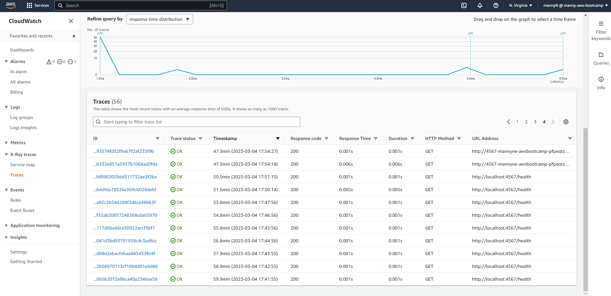
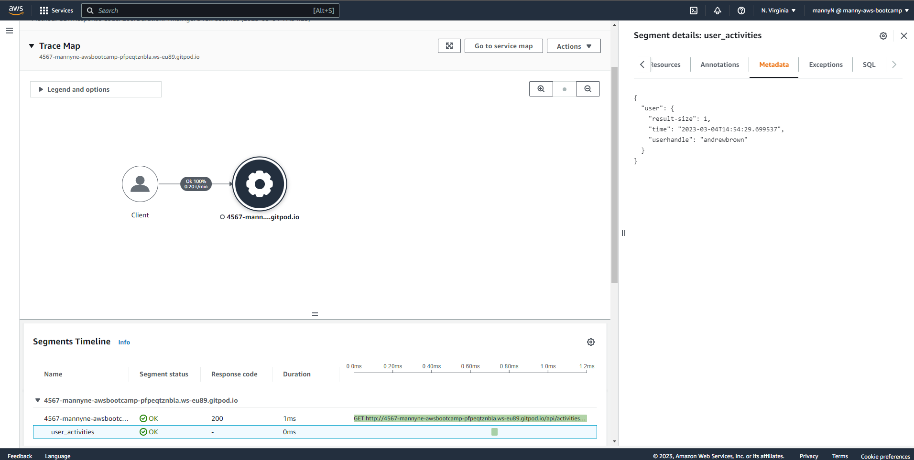
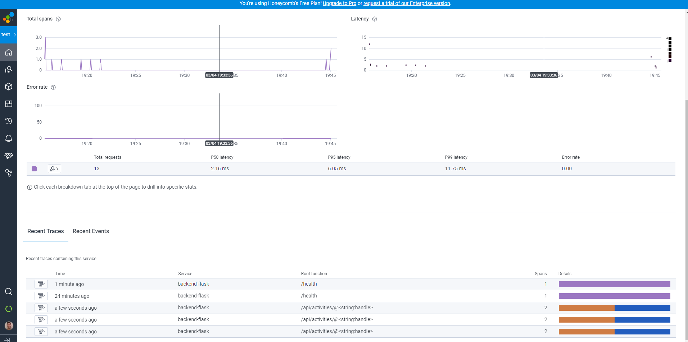
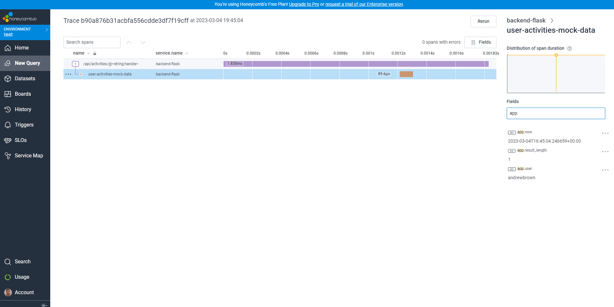

# Week 2 — Distributed Tracing

- In this week, we learnt about a variety of technologies to progress with our containerization knowledge. Some of the things we learnt include: 
    * Instrument our backend flask application to use Open Telemetry (OTEL) with Honeycomb.io as the provider
    * Run queries to explore traces within Honeycomb.io
    * Instrument AWS X-Ray into backend flask application
    * Configure and provision X-Ray daemon within docker-compose and send data back to X-Ray API
    * Observe X-Ray traces within the AWS Console
    * Integrate Rollbar for Error Logging
    * Trigger an error an observe an error with Rollbar
    * Install WatchTower and write a custom logger to send application log data to CloudWatch Log group

## Required Homework/Tasks (stretch)
- To test if we grasped the concepts provided to us through the meeting as well as the provided videos to aid us, we were given homeworks. They are:
    - [X] Configure instrumentation with X-RAY and add segments and subsegments.
    - [] Adding custom instrumentation to Honeycomb to add more attributes
    - [] Running custom queries in Honeycomb and saving them later


- I will describe my work and the process I overcame in the order provided above.

### Configuring instrumentation with X-RAY and adding segments and subsegments.
- In [this youtube video](https://www.youtube.com/watch?v=n2DTsuBrD_A&list=PLBfufR7vyJJ7k25byhRXJldB5AiwgNnWv&index=32) of the bootcamp, he showed us how to configure X-RAY with python. we captured some data using that configuration, but we ran into some issues at the end of that video. I used the documentation provided within [AWS github repo](https://github.com/aws/aws-xray-sdk-python) to debug the issue we faced. After adding a subsegment for the `user_activities` route, data started to trickle in X-RAY. I personally think it was an issue with using the default begin and end functions of the segments (highly suspected the begin segment because we already have the middleare creating segments, and because of that, we can only create subsegments), and I'm yet to figure it out. The sample code I added is shown below:
```
.
.
.
    # AWS X-RAY
    with xray_recorder.in_subsegment('user_activities') as subsegment:
      subsegment.put_metadata('userhandle', user_handle,'user')
      subsegment.put_metadata('time', now.isoformat(), 'user')
      subsegment.put_metadata('result-size', len(model['data']), 'user')
.
.
.
```
- The full updated code can be found [here](https://github.com/MannyNe/AWS-bootcamp/blob/week-2/backend-flask/services/user_activities.py)

- Here's the proof for the data shown in the X-RAY console:

<div align="center" style="font-weight: bold; margin-bottom:12px; padding-top:0px">Fig 1.0: Traces in X-RAY </div>


<div align="center" style="font-weight: bold; margin-bottom:12px; padding-top:0px">Fig 1.1: Segments and Subsegments in X-RAY with metadata </div>

----------------------
### Adding custom instrumentation to Honeycomb to add more attributes
- I added a custom instrumentation to add an attribute to the user activities route to see which user has the a large amount of data(activity) attached to his/her username. I added attributes called `now`, `user` and `result_length` to the `user_activities` file to check those data. Codes added: 
```
      span.set_attribute("app.now", now.isoformat())
      span.set_attribute("app.user", user_handle)
      span.set_attribute("app.result_length", len(model['data']))
```
- The full code can be found [here]()

- Here's the proof for the data shown in Honeycomb:

<div align="center" style="font-weight: bold; margin-bottom:12px; padding-top:0px">Fig 1.0: Honeycomb Traces </div>


<div align="center" style="font-weight: bold; margin-bottom:12px; padding-top:0px">Fig 1.1: Trace Data </div>

------------------------

### Running custom queries in Honeycomb and saving them later
- 