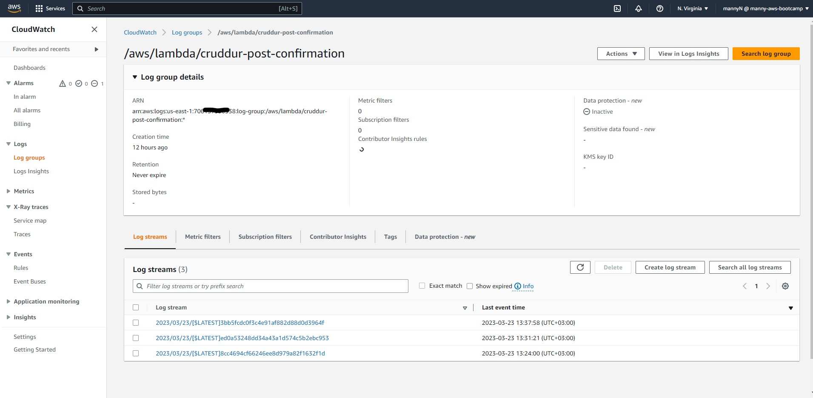
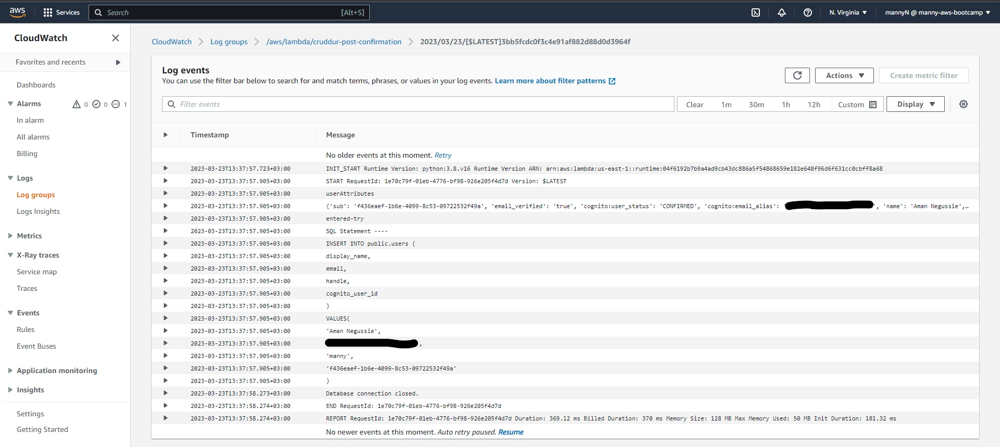
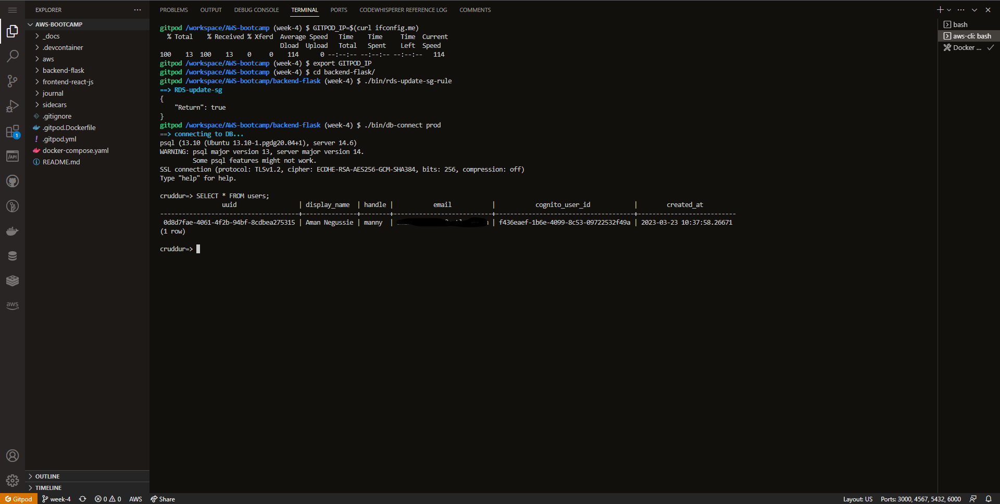
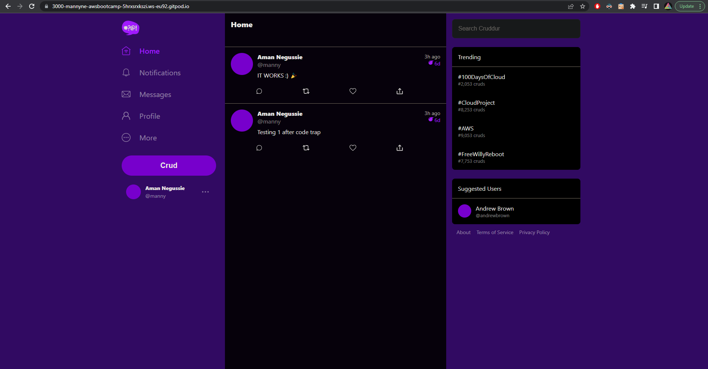

# Week 4 — Postgres and RDS


- In this week, we learnt about a variety of technologies to progress with our containerization knowledge. Some of the things we learnt include: 
    - [X] Create an RDS Database via the AWS CLI
    - [X] Create common bash scripts for common database tasks
    - [X] Installing Postgres in the backend application
    - [X] Connecting the RDS instance to Gitpod
    - [X] Created AWS Cognito trigger to insert user into database
    - [X] Created new activities with a database insert

- I will describe my work and the process in the order provided above.

### Create an RDS Database via the AWS CLI
- To create an RDS database, I used the AWS CLI. I followed the steps provided by Andrew in the [livestream](https://youtu.be/EtD7Kv5YCUs?list=PLBfufR7vyJJ7k25byhRXJldB5AiwgNnWv) which showed us how to create an RDS instance through ClickOps as well as using the CLI. The CLI is easier to create and use because AWS keeps on changing the UI (which is annoying). The following is a snippet for the code (script) I used:

```bash
#!/bin/bash

aws rds create-db-instance \
  --db-instance-identifier cruddur-db-instance \
  --db-instance-class db.t3.micro \
  --engine postgres \
  --engine-version  14.6 \
  --master-username root \
  --master-user-password mysupersecretpasswordwhichIwontpostlol \
  --allocated-storage 20 \
  --availability-zone us-east-1a \
  --backup-retention-period 0 \
  --port 5432 \
  --no-multi-az \
  --db-name cruddur \
  --storage-type gp3 \
  --publicly-accessible \
  --storage-encrypted \
  --enable-performance-insights \
  --performance-insights-retention-period 7 \
  --no-deletion-protection
```
- The only thing that I changed from the script provided was that I used the GP3 Storage Type instead of the default GP2, as well as change my reigon.

----------------------

### Create common bash scripts for common database tasks
- According to the livestream, we created sql files to create the database and tables. I created a script to load those tables to the database. Becasue flask doesn't handle(create) migrations, we had to create a scripts to do that. We created 5 scripts to handle modifications and connections to the database. We created a folder named `bin` found within the `backend-flask` folder and stored the scripts there. The following is are descriptions for the scripts:

    * `db-connect.sh` - This script is used to connect to the database. It takes in the database type as an optional argument. The script is used to connect to the database and run sql scripts or commands.
    * `db-create.sh` - This script is used to create the database `cruddur`.
    * `db-drop.sh` - This script is used to drop the database `cruddur`.
    * `db-schema-load.sh` - This script is used to load the schema into the database. It takes in the database type as an optional argument. The script is used to load the schema which is found within `db/schema.sql` into the database.
    * `db-seed.sh` - This script is used to seed the database. It takes in the database type as an optional argument. The script is used to seed the database by loading the seed data which is found within `db/seed.sql` into the database.

- The following is a snippet of the `db-schema-load.sh` script:
  
```bash
  #!/usr/bin/bash

  CYAN='\033[1;36m'
  NO_COLOR='\033[0m'
  LABEL="db-schema-load"
  printf "${CYAN}==> ${LABEL}${NO_COLOR}\n"

  schema_path="$(realpath .)/db/schema.sql"

  if [ "$1" = "prod" ]; then
      CON_URL=$PROD_CONNECTION_URL
  else
      CON_URL=$CONNECTION_URL
  fi

  psql $CON_URL cruddur < $schema_path
```
The script directory can be found [here](https://github.com/MannyNe/AWS-bootcamp/tree/week-4/backend-flask/bin).

------------------------

### Installing Postgres in the backend application
- I wouldn't call this step "installing" Postgres, but rather "connecting" or "configuring" Postgres to the backend application. I say this because we added the Postgres container/image to our docker file on `week-1`, where we learnt about Docker. The first thing I did was to add the `psycopg3` package to the `requirements.txt` file. We added the `binary` as well as the `pool` versions. This package is used to connect to the database. After installing the package, I created a new file called `db.py` within the `lib` directory and added the following code to it to help us format the output of the database queries:

```python
from psycopg_pool import ConnectionPool
import os

def query_wrap_object(template):
  sql = f"""
  (SELECT COALESCE(row_to_json(object_row),'{{}}'::json) FROM (
  {template}
  ) object_row);
  """
  return sql

def query_wrap_array(template):
  sql = f"""
  (SELECT COALESCE(array_to_json(array_agg(row_to_json(array_row))),'[]'::json) FROM (
  {template}
  ) array_row);
  """
  return sql

connection_url = os.getenv("CONNECTION_URL")
pool = ConnectionPool(connection_url)
```
The code can be found [here](https://github.com/MannyNe/AWS-bootcamp/blob/week-4/backend-flask/lib/db.py).

- After adding this file, we went on and modified the existing code in the `home_activity.py` file to help us query the activities which are located in the database:

```python
.
.
.
      sql = query_wrap_array("""
        SELECT
          activities.uuid,
          users.display_name,
          users.handle,
          activities.message,
          activities.replies_count,
          activities.reposts_count,
          activities.likes_count,
          activities.reply_to_activity_uuid,
          activities.expires_at,
          activities.created_at
        FROM public.activities
        LEFT JOIN public.users ON users.uuid = activities.user_uuid
        ORDER BY activities.created_at DESC
      """)
      with pool.connection() as conn:
        with conn.cursor() as cur:
          cur.execute(sql)
          # this will return a tuple
          # the first field being the data
          json = cur.fetchone()

      return json[0]
```
The full code can be found [here](https://github.com/MannyNe/AWS-bootcamp/blob/week-4/backend-flask/services/home_activities.py).

- We used this code to query the activities from the database. Now before we can run the application, we need to create the database and load the schema into the database. We can do this by running the script found within the `bin` folder, called `db-schema-load.sh`. After loading our schema, seeding our database and passing the code-traps successfully, we ran the application and it worked as expected.

------------------------

### Connecting the RDS instance to Gitpod
- After making sure the local development environment works, 
we went to AWS RDS to strt up our database that we shut down in the livestream. Then, we connected the RDS instance to Gitpod by adding the following code to the `docker-compose.yml` file:

```yml
.
.
.
  backend-flask:
    container_name: "backend_flask"
    environment:
      CONNECTION_URL: "${PROD_CONNECTION_URL}"
.
.
.
```
- The `PROD_CONNECTION_URL` is the connection url to the remote database. We added this to the `docker-compose.yml` file so that we can connect to the database from Gitpod. After adding this, we updated our security groups so that we could access our database from our local environment (Gitpod) by adding its IP address to the security group. We got our IP address by running the following command in the terminal:

```bash
$ GITPOD_ID=$(curl ifconfig.me)
$ echo $GITPOD_ID
```
- Running the above command will give us our IP address. We then added this IP address to the security group of our database. But this is a one time solution because everytime our gitpod restarts, it gives us a new address, which the security-group will not be able to recognize. To solve this, we added a script called `rds-update-sg-rule.sh` to the `bin` directory. This script will update the security group of our database to allow access from our current IP address. The following is a snippet of the script:

```bash
#!/usr/bin/bash

CYAN='\033[1;36m'
NO_COLOR='\033[0m'
LABEL="RDS-update-sg"
printf "${CYAN}==> ${LABEL}${NO_COLOR}\n"

aws ec2 modify-security-group-rules \
    --group-id $DB_SG_ID \
    --security-group-rules "SecurityGroupRuleId=$DB_SG_RULE_ID,SecurityGroupRule={Description=GITPOD,IpProtocol=tcp,FromPort=5432,ToPort=5432,CidrIpv4=$GITPOD_IP/32}"
```
- Before running this script, we need to set the following environment variables:

```bash
export GITPOD_IP
export DB_SG_ID="security-group-ID"
gp env DB_SG_ID="security-group-ID"
export DB_SG_RULE_ID="security-group-rule-ID"
gp env DB_SG_RULE_ID="security-group-rule-ID"
```
- After setting the environment variables, we ran the script to check if it worked, and it did. After that we configured the `.gitpod.yml` file to run the script everytime we start our gitpod instance. The following is a snippet of the `.gitpod.yml` file:

```yml
.
.
.
tasks:
  - name: aws-cli
    env:
      AWS_CLI_AUTO_PROMPT: on-partial
  - name: update-ip
    command: |
      export GITPOD_IP=$(curl ifconfig.me)
      source "$THEIA_WORKSPACE_ROOT/backend-flask/bin/rds-update-sg-rule"
.
.
.
```
- After adding this, we restarted our gitpod instance and ran the script to check if it worked. It worked as expected. After this, we loaded our schema to the production database. Then we ran the application and it worked as expected. No errors, but an empty activities because we didn't have any data.

------------------------

### Created AWS Cognito trigger to insert user into database
- We created a trigger in AWS Cognito to insert a user into the database when a user signs up. To do that, we went to AWS to create a lambda function. We configured the lambda function through ClickOps then I added the VPC then and there because the lambda will need the security group of the database to be able to connect to it for post confirmation. After that we added the environment variables needed as well as add a layer to the lambda from the `arn` provided to us in the week-4 documentation. I'm currently in the us-east region so I used the `us-east-1` arn. After adding the layer, we created a new file within the `aws` folder called `cruddur-post-confirmation.py` to add the code we would add to the lambda later. The following is a snippet of the code:

```python
import json
import psycopg2
import os

def lambda_handler(event, context):
    user = event['request']['userAttributes']
    print('userAttributes')
    print(user)

    user_display_name  = user['name']
    user_email         = user['email']
    user_handle        = user['preferred_username']
    user_cognito_id    = user['sub']
    try:
      print('entered-try')
      sql = f"""
         INSERT INTO public.users (
          display_name, 
          email,
          handle, 
          cognito_user_id
          ) 
        VALUES(
          '{user_display_name}', 
          '{user_email}', 
          '{user_handle}', 
          '{user_cognito_id}'
        )
      """
      print('SQL Statement ----')
      print(sql)
      conn = psycopg2.connect(os.getenv('CONNECTION_URL'))
      cur = conn.cursor()
      cur.execute(sql)
      conn.commit() 

    except (Exception, psycopg2.DatabaseError) as error:
      print(error)
    finally:
      if conn is not None:
          cur.close()
          conn.close()
          print('Database connection closed.')
    return event
```
The code can be found [here](https://github.com/MannyNe/AWS-bootcamp/blob/week-4/aws/lambdas/cruddur-post-confirmation.py).

- After that, we updated out schema.sql file to add the `email` column to the `users` table, as well as introduced more changes. The following is a snippet of the updated schema:

```sql
CREATE TABLE public.users (
  uuid UUID DEFAULT uuid_generate_v4() PRIMARY KEY,
  display_name text NOT NULL,
  handle text NOT NULL,
  email text NOT NULL,
  cognito_user_id text NOT NULL,
  created_at TIMESTAMP default current_timestamp NOT NULL
);

CREATE TABLE public.activities (
  uuid UUID DEFAULT uuid_generate_v4() PRIMARY KEY,
  user_uuid UUID NOT NULL,
  message text NOT NULL,
  replies_count integer DEFAULT 0,
  reposts_count integer DEFAULT 0,
  likes_count integer DEFAULT 0,
  reply_to_activity_uuid integer,
  expires_at TIMESTAMP,
  created_at TIMESTAMP default current_timestamp NOT NULL
);
```
The code can be found [here](https://github.com/MannyNe/AWS-bootcamp/blob/week-4/backend-flask/db/schema.sql).

- After configuring the code and schema, we added the trigger to the post confirmation trigger. After adding the trigger, we added the code in the  `cruddur-post-confirmation.py` file to the lambda editor to deploy it. After deployment, we tested it by signing up a new user. First we checked the logs if everything went well according to lambda and cloud watch, which it did:


<div align="center" style="font-weight: bold; margin-bottom:12px; padding-top:0px">Fig 1.0: Cloudwatch log dashboard </div>


<div align="center" style="font-weight: bold; margin-bottom:12px; padding-top:0px">Fig 1.1: Cloudwatch log </div>

And user was successfully added to the database. The following is a screenshot of the user in the database:


<div align="center" style="font-weight: bold; margin-bottom:12px; padding-top:0px">Fig 1.2: Production Database Query </div>

------------------------

### Created new activities with a database insert
- I created a new activity following the steps in the video from the [Week 4 - Creating Activities](https://www.youtube.com/watch?v=fTksxEQExL4&list=PLBfufR7vyJJ7k25byhRXJldB5AiwgNnWv&index=49). But this step was one of the harderst(in terms of code traps). I had to do a lot of debugging to get it to work. I had to replace the hard coded usernames and all from the backend as well as frontend files. I encountered the NON-NULL error because it was trying to fetch a user which wasnt the hardcoded user. After correcting the hardcoded values to be fetched from the frontend as well as from the database, I was able to post a crud. The following is a screenshot of the cruds I posted:


<div align="center" style="font-weight: bold; margin-bottom:12px; padding-top:0px">Fig 1.0: Cruddur Homepage including cruds </div>