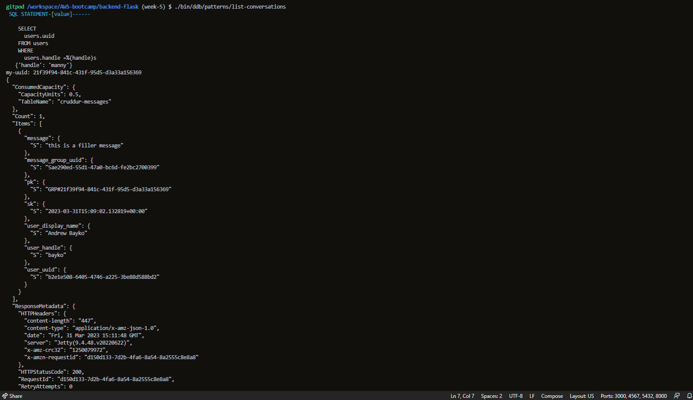

# Week 5 — DynamoDB and Serverless Caching

- In this week, we learnt about a variety of technologies to progress with our DynamoDB knowledge. Some of the things we learnt include: 
    * Data Modelling a Direct Messaging System using Single Table Design
    * Implementing DynamoDB query using Single Table Design
    * Provisioning DynamoDB tables with Provisioned Capacity
    * Utilizing a Global Secondary Index (GSI) with DynamoDB
    * Rapid data modelling and implementation of DynamoDB with DynamoDB Local
    * Writing utility scripts to easily setup and teardown and debug DynamoDB data

## Required Homework/Tasks (class summary)
- To test if we grasped the concepts provided to us through the meeting as well as the provided videos to aid us, we were given homeworks. They are:
    - [X] Implementing the schema load, seed, scan scripts as well as the pattern scripts for read and list conversations.
    - [X] Implementing the updating of the Cognito ID Script for Postgres Database, listing messages group into application(for all patterns) and creating a message for an existing message group into application(for all patterns)
    - [X] Implementing the updating of a Message Group using DynamoDB Streams

- I will describe my work and the process in the order provided above.

### Implementing the schema load, seed, scan scripts as well as the pattern scripts for read and list conversations.
- Implementing the schema load
    * The process for implementing the schema load was straight forward. There was no much code traps to successfully implement the schema load. We used the [Boto3 Docs](https://boto3.amazonaws.com/v1/documentation/api/latest/index.html) to implement the script. the following is a snippet for the script:
    ```python
    #!/usr/bin/env python3

    import boto3
    import sys

    attrs = {
      'endpoint_url': 'http://localhost:8000'
    }

    if len(sys.argv) == 2:
      if "prod" in sys.argv[1]:
        attrs = {}

    ddb = boto3.client('dynamodb',**attrs)

    table_name = 'cruddur-messages'


    response = ddb.create_table(
      TableName=table_name,
      AttributeDefinitions=[
        {
          'AttributeName': 'message_group_uuid',
          'AttributeType': 'S'
        },
        {
          'AttributeName': 'pk',
          'AttributeType': 'S'
        },
        {
          'AttributeName': 'sk',
          'AttributeType': 'S'
        },
      ],
      .
      .
      .
    ```
    The full code can be found [here](https://github.com/MannyNe/AWS-bootcamp/blob/week-5/backend-flask/bin/ddb/schema-load).

    The following is the output while running the script:

    
    <div align="center" style="font-weight: bold; margin-bottom:12px; padding-top:0px">Fig 1.0: Loading the schema</div>

- Implementing the seeding
    * The seeding script was straight forward as well, we had a list of generated conversations that were set to use in the seeding script. I changed the seeding script's `my_user` to be my handle. This was one of the codetraps I faced, which I will describe in the later parts of the documentation. We wont use this seed for the production environment due to costs(instead of puts, we would use batch writes). The following is a snippet of the script:
    ```python
    #!/usr/bin/env python3

    import boto3
    import os
    import sys
    from datetime import datetime, timedelta, timezone
    import uuid

    current_path = os.path.dirname(os.path.abspath(__file__))
    parent_path = os.path.abspath(os.path.join(current_path, '..', '..'))
    sys.path.append(parent_path)
    from lib.db import db

    attrs = {
      'endpoint_url': 'http://localhost:8000'
    }
    # unset endpoint url for use with production database
    if len(sys.argv) == 2:
      if "prod" in sys.argv[1]:
        attrs = {}
    ddb = boto3.client('dynamodb',**attrs)

    def get_user_uuids():
      sql = """
        SELECT 
          users.uuid,
          users.display_name,
          users.handle
        FROM users
        WHERE
          users.handle IN(
            %(my_handle)s,
            %(other_handle)s
            )
      """
      users = db.query_array_json(sql,{
        'my_handle':  'manny',
        'other_handle': 'bayko'
      })
      my_user    = next((item for item in users if item["handle"] == 'manny'),  None)
      other_user = next((item for item in users if item["handle"] == 'bayko'),  None)
      results = {
        'my_user': my_user,
        'other_user': other_user
      }
      print('get_user_uuids')
      print(results)
      return results
      .
      .
      .
    ```
    The full code can be found [here](https://github.com/MannyNe/AWS-bootcamp/blob/week-5/backend-flask/bin/ddb/seed).

    The following is the output while running the script:

    
    <div align="center" style="font-weight: bold; margin-bottom:12px; padding-top:0px">Fig 1.1: Seeding the database</div>

- Implementing the scan scripts
    * To be sure the data is within the DB, we created the scan script. This was also a straight forward process we followed with the help of some documentations as well as ChatGPT. This script shows us the messages inserted within the database. The following is a snippet of the script:
    ```python
    #!/usr/bin/env python3
    import boto3

    attrs = {
      'endpoint_url': 'http://localhost:8000'
    }
    ddb = boto3.resource('dynamodb',**attrs)
    table_name = 'cruddur-messages'

    table = ddb.Table(table_name)
    response = table.scan()

    items = response['Items']
    for item in items:
      print(item)
    ```
    The code can be found [here](https://github.com/MannyNe/AWS-bootcamp/blob/week-5/backend-flask/bin/ddb/scan).

    The following is the output while running the script:

    
    <div align="center" style="font-weight: bold; margin-bottom:12px; padding-top:0px">Fig 1.2: Scanning messages</div>

- Implementing the access pattern scripts for read and list conversations
    * The pattern scripts are used for a more granular view of the data. The scripts within the `patterns` folder helps in showing us more options and how much our query costs for scanning the DB. Their function is simillar like the scan script, but these scripts have much more detail and limits on how much data is fetched from the database. The following is a snippet of the `list-conversations`script:
    ```python
    .
    .
    .
    def get_my_user_uuid():
        sql = """
          SELECT 
            users.uuid
          FROM users
          WHERE
            users.handle =%(handle)s
        """
        uuid = db.query_value(sql,{
          'handle':  'manny'
        })
        return uuid

    my_user_uuid = get_my_user_uuid()
    print(f"my-uuid: {my_user_uuid}")
    year = str(datetime.now().year)
    # define the query parameters
    query_params = {
      'TableName': table_name,
      'KeyConditionExpression': 'pk = :pk AND begins_with(sk,:year)',
      'ScanIndexForward': False,
      'ExpressionAttributeValues': {
        ':year': {'S': year },
        ':pk': {'S': f"GRP#{my_user_uuid}"}
      },
      'ReturnConsumedCapacity': 'TOTAL'
    }
    .
    .
    .
    ```
    And the snippet of the `get-conversation` script:
    ```python
    .
    .
    .
    dynamodb = boto3.client('dynamodb',**attrs)
    table_name = 'cruddur-messages'

    message_group_uuid = "5ae290ed-55d1-47a0-bc6d-fe2bc2700399"

    year = str(datetime.datetime.now().year)
    # define the query parameters
    query_params = {
      'TableName': table_name,
      'ScanIndexForward': False,
      'Limit': 20,
      'ReturnConsumedCapacity': 'TOTAL',
      'KeyConditionExpression': 'pk = :pk AND begins_with(sk,:year)',
      #'KeyConditionExpression': 'pk = :pk AND sk BETWEEN :start_date AND :end_date',
      'ExpressionAttributeValues': {
        ':year': {'S': year },
        #":start_date": { "S": "2023-03-01T00:00:00.000000+00:00" },
        #":end_date": { "S": "2023-03-19T23:59:59.999999+00:00" },
        ':pk': {'S': f"MSG#{message_group_uuid}"}
      }
    }
    .
    .
    .
    ```
    The full code for both script can be found in the directory [here](https://github.com/MannyNe/AWS-bootcamp/tree/week-5/backend-flask/bin/ddb/patterns)

    The following is the output while running the `list-conversations` script:
    
    
    <div align="center" style="font-weight: bold; margin-bottom:12px; padding-top:0px">Fig 1.3: list-conversations</div>

    The following is the output while running the `get-conversation` script:
    
    
    <div align="center" style="font-weight: bold; margin-bottom:12px; padding-top:0px">Fig 1.4: get-conversation</div>


------------------------

### Implementing the updating of the Cognito ID Script for Postgres Database, listing messages group into application(for all patterns) and creating a message for an existing message group into application(for all patterns).
This section of the classwork was one of the hardest, as well as the most challenging code-traps I had to go through. This is the second most challenging week I faced apart from week-3. I'll list the challenges I faced and how I overcame them.

- Updating of the Cognito ID Script for Postgres Database and listing messages group into application(for all patterns)
    * We created a script to update the cognito ID in our local postgres database. We had a seed data that had the following record:
    ```sql
    -- this file was manually created
    INSERT INTO public.users (display_name, email, handle,  cognito_user_id)
    VALUES
      ('Andrew Brown','andrew@exampro.co' , 'andrewbrown' ,'MOCK'),
      ('Andrew Bayko','bayko@exampro.co' , 'bayko' ,'MOCK');

    INSERT INTO public.activities (user_uuid, message, expires_at)
    VALUES
      (
        (SELECT uuid from public.users WHERE users.handle =     'andrewbrown' LIMIT 1),
        'This was imported as seed data!',
        current_timestamp + interval '10 day'
      )
    ```
    As we can see from the above code, the `cognito_user_id` is set to `MOCK`. We had to update this to the actual cognito ID. The following is a snippet of the script:
    ```python
    .
    .
    .
    current_path = os.path.dirname(os.path.abspath(__file__))
    parent_path = os.path.abspath(os.path.join(current_path, '..', '..  '))
    sys.path.append(parent_path)
    from lib.db import db

    def update_users_with_cognito_user_id(handle,sub):
      sql = """
        UPDATE public.users
        SET cognito_user_id = %(sub)s
        WHERE
          users.handle = %(handle)s;
      """
      db.query_commit(sql,{
        'handle' : handle,
        'sub' : sub
      })
    .
    .
    .
    ```
    The full code can be found [here](https://github.com/MannyNe/AWS-bootcamp/tree/week-5/backend-flask/bin/db/update_cognito_user_ids)
    - This script fetches the cognito userId from cognito and updates the postgres database with the actual cognito ID. But as we can see here, the users we have are andrewbrown and bayko. If we run the script, nothing wold be updated because we don't have a record with the handle `andrewbrown` or `andrewbayko`. I had to add my user which I registered through cognito to the seed file in cognito and update the postgres database with the new user. The following is a snippet of the code:
    ```sql
    -- this file was manually created
    INSERT INTO public.users (display_name, email, handle,  cognito_user_id)
    VALUES
      ('Andrew Brown','andrew@exampro.co' , 'andrewbrown' ,'MOCK'),
      ('Andrew Bayko','bayko@exampro.co' , 'bayko' ,'MOCK'),
      ('Aman Negussie','manny@exampro.co' , 'manny' ,'MOCK'),
      ('Londo Mollari','lmollari@centari.com' ,'londo' ,'MOCK');

    INSERT INTO public.activities (user_uuid, message, expires_at)
    VALUES
      (
        (SELECT uuid from public.users WHERE users.handle =     'andrewbrown' LIMIT 1),
        'This was imported as seed data!',
        current_timestamp + interval '10 day'
      )
    ```
    The user with the handle `manny` is my account, then this will be easy to update the cognito ID. Because of these changes, I had to modify the ddb seed data to make the conversation between me and the other users. The updated files are the `seed` and `list-conversations` script files by replacing the `andrewbrown` handle with `manny`. The full code can be found here:
    * [seed](https://github.com/MannyNe/AWS-bootcamp/blob/week-5/backend-flask/bin/ddb/seed)
    * [list-conversations](https://github.com/MannyNe/AWS-bootcamp/blob/week-5/backend-flask/bin/ddb/patterns/list-conversations)

    After doing this, the messages will be between me and the other user (bayko). The following is a screenshot of the list of messages I have with other users in my DB:

    
    <div align="center" style="font-weight: bold; margin-bottom:12px; padding-top:0px">Fig 1.0: Message List</div>

    
    <div align="center" style="font-weight: bold; margin-bottom:12px; padding-top:0px">Fig 1.1: Message between Bayko and I</div>

- Creating a message for an existing message group into application(for all patterns)
    * For creating a message between other users and I, we updated the `ddb.py` file located in the `lib` folder. We added a `create_message_group` function. The function helps us create messages by using a batch write in the perspective of both users as well as the message itself. Then we updated the `create_message`, `message_groups`, as well as the `message` service to handle those requests. And in the frontend code, we updated the `MessageGroupPage` as well as the `MessageGroupsPage` pages to handle the creation of a message by adding an authorization header to get info from the database. In our `MessageForm` component, we updated the `onSubmit` function to handle the creation of a message. The following is a snippet of the code:
    ```javascript
    .
    .
    .
      const onsubmit = async (event) => {
      event.preventDefault();
      try {
        const backend_url = `${process.env.REACT_APP_BACKEND_URL}/api/    messages`
        console.log('onsubmit payload', message)
        let json = { 'message': message }
        if (params.handle) {
          json.handle = params.handle
        } else {
          json.message_group_uuid = params.message_group_uuid
        }

        const res = await fetch(backend_url, {
          method: "POST",
          headers: {
            'Authorization': `Bearer ${localStorage.getItem   ("access_token")}`,
            'Accept': 'application/json',
            'Content-Type': 'application/json'
          },
          body: JSON.stringify(json)
        });
        let data = await res.json();
        if (res.status === 200) {
          console.log('data:',data)
          if (data.message_group_uuid) {
            console.log('redirect to message group')
            window.location.href = `/messages/${data. message_group_uuid}`
          } else {
            props.setMessages(current => [...current,data]);
          }
        } else {
          console.log(res)
        }
      } catch (err) {
        console.log(err);
      }
    }
    .
    .
    .
    ```
    As we can see from above, we editied the body to contain the message that the user wrote. The message will be sent to the backend for processing. After adding new sql files and modifiying some scripts, we were able to send messages to message groups which already exist. The following is a screenshot of the message I sent to the message group between Bayko and I:

    
    <div align="center" style="font-weight: bold; margin-bottom:12px; padding-top:0px">Fig 1.0: New message sent to Bayko</div>

    - After confirming this works, I added a new user to the database and sent a message to that user (londo). For that to happen, we added a new page in the frontend called `MessageGroupNewPage` to handle the creation of a new message group and show it in the frontend. The following is a snippet of the code:
    ```javascript
    .
    .
    .
      React.useEffect(()=>{
        //prevents double call
        if (dataFetchedRef.current) return;
        dataFetchedRef.current = true;

        loadMessageGroupsData();
        loadUserShortData();
        checkAuth(setUser);
      }, [])
      return (
        <article>
          <DesktopNavigation user={user} active={'home'} setPopped= {setPopped} />
          <section className='message_groups'>
            <MessageGroupFeed otherUser={otherUser} message_groups= {messageGroups} />
          </section>
          <div className='content messages'>
            <MessagesFeed messages={messages} />
            <MessagesForm setMessages={setMessages} />
          </div>
        </article>
      );
    ```
    This code will show the new message created between a user and I. This code will send a request to an endpoint we created in the backend to create a new message group by taking the username of the user we want to send a message to. That endpoint is called `short`. when this endpoint gets triggered, the backend runs a service called `users_short` which will return the user's information. The following is the code used:
    ```python
    from lib.db import db

    class UsersShort:
      def run(handle):
        sql = db.template('users','short')
        results = db.query_object_json(sql,{
          'handle': handle
        })
        return results
    ```
    This service will fetch the user information from the database and return it to the frontend. After setting the code up, I was able to send a message to the user Londo. The following is a screenshot of the new message I sent to londo:

    
    <div align="center" style="font-weight: bold; margin-bottom:12px; padding-top:0px">Fig 1.1: New message sent to Londo</div>


------------------------

###  Implementing the updating of a Message Group using DynamoDB Streams
- This part of the summary was the most straightforward and easy parts of the whole class summary. The reason I say this was we did the hard part in the stage before this when we updated our code to handle the messages and all. In this step, we added a new lambda function that will capture streams that would update message groups. After following the video by Andrew, I was able to succesfully send messages as well as capture streams and save messages to the DB. The following is a screenshot of the new message I sent to londo in the production environment:

    
    <div align="center" style="font-weight: bold; margin-bottom:12px; padding-top:0px">Fig 1.0: New message sent to Londo in production</div>

    
    <div align="center" style="font-weight: bold; margin-bottom:12px; padding-top:0px">Fig 1.1: Cloudwatch logs of incoming stream</div>

    
    <div align="center" style="font-weight: bold; margin-bottom:12px; padding-top:0px">Fig 1.2: New messages added to the DB</div>