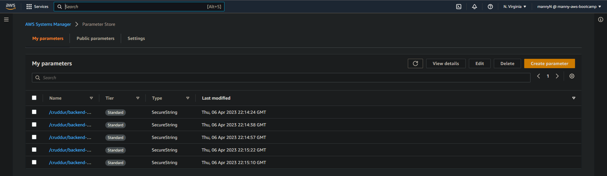

# Week 6 — Deploying Containers

- In this week, we learnt about a variety of technologies to progress with our ECS, ECR and Deployment knowledge. Some of the things we learnt include: 
    * Deploy an ECS Cluster using ECS Service Connect
    * Deploy serverless containers using Fargate for the Backend and Frontend Application
    * Route traffic to the frontend and backend on different subdomains using Application Load Balancer
    * Securing our flask container
    * Creating several bash utility scripts to easily work with serverless containers.

## Required Homework/Tasks (class summary)
- To test if we grasped the concepts provided to us through the meeting as well as the provided videos to aid us, we were given homeworks. They are:
    - [X] Provisioning an ECS cluster, creating an ECR repo then pushing both frontend and backend images, and deploying both apps to fargate.
    - [ ] Provisioning and configuring Application Load Balancer along with target groups.
    - [ ] Managed my domain using Route53, created an SSL certificate via ACM, setup a record set for naked domain to point to frontend-react-js, setup a record set for api subdomain to point to the backend-flask, and Configure CORS to only permit traffic from our domain.
    - [ ] Secured Flask by not running in debug mode for production
    - [ ] Implemented Refresh Token for Amazon Cognito
    - [ ] Refactored bin directory to be top level
    - [ ] Configured task defintions to contain x-ray and turn on Container Insights
    - [ ] Changed Docker Compose to explicitly use a user-defined network
    - [ ] Created Dockerfile specfically for production use case
    - [ ] Used ruby generate out env dot files for docker using erb templates

- I will describe my work and the process in the order provided above.

### Provisioning an ECS cluster, creating an ECR repo then pushing both frontend and backend images, and deploying both apps to fargate.
- Provisioning an ECS Cluster
    * To provision an ECS cluster, I followed the 3hr video that was posted on the exampro channel. The process was straight forward and I was able to provision an ECS cluster with no issues. I used the CLI to provision the cluster. The command I used was:
    ```sh
        aws ecs create-cluster \
        --cluster-name cruddur \
        --service-connect-defaults namespace=cruddur
    ```
    This command created a cluster named cruddur with empty services. The image below shows a successful run of the command:
    
    <div align="center" style="font-weight: bold; margin-bottom:12px; padding-top:0px">Fig 1.0: Creating a cluster</div>

- Creating an ECR repo
    * To create an ECR repo, I used the CLI command which was in the week-6 video. The first thing I did was login to my AWS account using the CLI to access ECR. I used the command:
    ```sh
        aws ecr get-login-password --region $AWS_DEFAULT_REGION | docker login --username AWS --password-stdin "$AWS_ACCOUNT_ID.dkr.ecr.$AWS_DEFAULT_REGION.amazonaws.com"
    ```
    A successful login will look like this:
    
    <div align="center" style="font-weight: bold; margin-bottom:12px; padding-top:0px">Fig 1.1: Logging in</div>

    After logging in, we created a repository to store our images. I created a repository for three images, namely `cruddur-python`, `backend-flask` and `frontend-react-js`. The command I used for `cruddur-python`:
    ```sh
        aws ecr create-repository \
            --repository-name cruddur-python \
            --image-tag-mutability MUTABLE
    ```

    for `backend-flask`:
    ```sh
        aws ecr create-repository \
            --repository-name backend-flask \
            --image-tag-mutability MUTABLE
    ```

    and for `frontend-react-js`:
    ```sh
        aws ecr create-repository \
            --repository-name frontend-react-js \
            --image-tag-mutability MUTABLE
    ```
    
    A successful run of these commands will look like this in AWS ECR console:
    
    <div align="center" style="font-weight: bold; margin-bottom:12px; padding-top:0px">Fig 1.2: AWS ECR Console</div>

    After setting the repository, I had to update my ECR URL's to push each images to their respective ECR repositories. To set the correct ECR repository for all the repositories, I used the commands:
    
    for `cruddur-python`:
    ```sh
        export ECR_PYTHON_URL="$AWS_ACCOUNT_ID.dkr.ecr.$AWS_DEFAULT_REGION.amazonaws.com/cruddur-python"
    ```

    for `backend-flask`:
    ```sh
        export ECR_BACKEND_FLASK_URL="$AWS_ACCOUNT_ID.dkr.ecr.$AWS_DEFAULT_REGION.amazonaws.com/backend-flask"
    ```

    for `frontend-react-js`:
    ```sh
        export ECR_FRONTEND_REACT_URL="$AWS_ACCOUNT_ID.dkr.ecr.$AWS_DEFAULT_REGION.amazonaws.com/frontend-react-js"
    ```

- Pushing both frontend and backend images
    * After setting the URL's as described above, I pulled, tagged and pushed the images to ECR. For python and only python, I had to first pull the image from [DockerHub](https://hub.docker.com/). To pull the image, I used the command:
    ```sh
        docker pull python:3.10-slim-buster
    ```

    For the rest of the images, I had to build them using the `Dockerfile` located within each of the folders. To build the images, I used the commands:

    for `backend-flask`
    ```sh
        docker build -t backend-flask .
    ```

    for `frontend-react-js`:
    ```sh
        docker build \
        --build-arg REACT_APP_BACKEND_URL="https://4567-$GITPOD_WORKSPACE_ID.$GITPOD_WORKSPACE_CLUSTER_HOST" \
        --build-arg REACT_APP_AWS_PROJECT_REGION="$AWS_DEFAULT_REGION" \
        --build-arg REACT_APP_AWS_COGNITO_REGION="$AWS_DEFAULT_REGION" \
        --build-arg REACT_APP_AWS_USER_POOLS_ID="ca-central-1_CQ4wDfnwc" \
        --build-arg REACT_APP_CLIENT_ID="5b6ro31g97urk767adrbrdj1g5" \
        -t frontend-react-js \
        -f Dockerfile.prod \
        .
    ```
    The files for the backend and frontend are located [backend-dockerfile](https://github.com/MannyNe/AWS-bootcamp/blob/week-6/backend-flask/Dockerfile) and [frontend-dockerfile](https://github.com/MannyNe/AWS-bootcamp/blob/week-6/frontend-react-js/Dockerfile.prod) respectively.

    After building the images, I tagged them and pushed them to ECR. To tag the images, I used the commands:

    for `backend-flask`
    ```sh
        docker tag backend-flask:latest $ECR_BACKEND_FLASK_URL:latest
        docker push $ECR_BACKEND_FLASK_URL:latest
    ```

    for `frontend-react-js`:
    ```sh
        docker tag frontend-react-js:latest $ECR_FRONTEND_REACT_URL:latest
        docker push $ECR_FRONTEND_REACT_URL:latest
    ```
    
    After tagging then pushing the images to their respective ECR repositories, we can see the following images in the repositories:
    
    <div align="center" style="font-weight: bold; margin-bottom:12px; padding-top:0px">Fig 1.3: Python Repository</div>

    
    <div align="center" style="font-weight: bold; margin-bottom:12px; padding-top:0px">Fig 1.4: Backend Repository</div>

    
    <div align="center" style="font-weight: bold; margin-bottom:12px; padding-top:0px">Fig 1.5: Frontend Repository</div>

- Deploying both apps to fargate
    * Before deploying our apps to fargate, we had to configure roles, policies and task-definitions in that order. To configure roles, I used the command:

    ```sh
    aws iam create-role \    
    --role-name CruddurServiceExecutionPolicy  \   
    --assume-role-policy-document file://aws/policies/service-assume-role-execution-policy.json
    ```
    Before executing the commands above, I had to create a file called `service-assume-role-execution-policy.json` in the `aws/policies` folder. The content of the file is:

    ```json
    {
        "Version":"2012-10-17",
        "Statement":[{
            "Action":["sts:AssumeRole"],
            "Effect":"Allow",
            "Principal":{
            "Service":["ecs-tasks.amazonaws.com"]
            }
        }]
    }
    ```
    The file can be found [here](https://github.com/MannyNe/AWS-bootcamp/blob/week-6/aws/policies/service-assume-role-execution-policy.json)

    A successful execution of the command above will return the following:
    
    <div align="center" style="font-weight: bold; margin-bottom:12px; padding-top:0px">Fig 1.6: Creating Role</div>

    After creating the role, I had to create a policy for the role. To create the policy, I used the command:

    ```sh
    aws iam put-role-policy \
    --policy-name CruddurServiceExecutionPolicy \
    --role-name CruddurServiceExecutionRole \
    --policy-document file://aws/policies/service-execution-policy.json
    ```
    Before executing the commands above, I had to create a file called `service-execution-policy.json` in the `aws/policies` folder. The content of the file is:

    ```json
    {
        "Version":"2012-10-17",
        "Statement":[{
          "Effect": "Allow",
          "Action": [
            "ssm:GetParameters",
            "ssm:GetParameter"
          ],
          "Resource": "arn:aws:ssm:us-east-1:706157350338:parameter/cruddur/backend-flask/*"
        }]
    }
    ```
    The file can be found [here](https://github.com/MannyNe/AWS-bootcamp/blob/week-6/aws/policies/service-execution-policy.json)

    After creating the policy, I had to attach the policy to the role. To do that, I fetched the ARN the `put-role-policy` command returns. Then I used the command:

    ```sh
    aws iam attach-role-policy --policy-arn POLICY_ARN --role-name CruddurServiceExecutionRole
    ```

    A successful execution of both commands above will attach the roles and policies together. Taking a look at the console will show the following:
    
    <div align="center" style="font-weight: bold; margin-bottom:12px; padding-top:0px">Fig 1.7: Role and Policy</div>

    After creating and attaching the policy, I had to create a task-definition for both apps. Before that, I need to store my parameter details, which will be stored in the systems manager. To do that we used the CLI commands which were provided in the week-6 documentation. The list of CLI commands I used are:

    ```
    aws ssm put-parameter --type "SecureString" --name "/cruddur/backend-flask/AWS_ACCESS_KEY_ID" --value $AWS_ACCESS_KEY_ID
    aws ssm put-parameter --type "SecureString" --name "/cruddur/backend-flask/AWS_SECRET_ACCESS_KEY" --value $AWS_SECRET_ACCESS_KEY
    aws ssm put-parameter --type "SecureString" --name "/cruddur/backend-flask/CONNECTION_URL" --value $PROD_CONNECTION_URL
    aws ssm put-parameter --type "SecureString" --name "/cruddur/backend-flask/ROLLBAR_ACCESS_TOKEN" --value $ROLLBAR_ACCESS_TOKEN
    aws ssm put-parameter --type "SecureString" --name "/cruddur/backend-flask/OTEL_EXPORTER_OTLP_HEADERS" --value "x-honeycomb-team=$HONEYCOMB_API_KEY"
    ```
    After running these commands, we can check the console if we stored those parameters correctly. If we did, we should see the list as the following image:
    
    <div align="center" style="font-weight: bold; margin-bottom:12px; padding-top:0px">Fig 1.8: SSM Parameters</div>

    After storing the parameters, we created a new role called `CruddurTaskRole` which helps us use session managers and all. To create the role, we used the command:

    ```sh
    aws iam create-role \
        --role-name CruddurTaskRole \
        --assume-role-policy-document "{
        \"Version\":\"2012-10-17\",
        \"Statement\":[{
            \"Action\":[\"sts:AssumeRole\"],
            \"Effect\":\"Allow\",
            \"Principal\":{
                \"Service\":[\"ecs-tasks.amazonaws.com\"]
            }
        }]
    }"
    ```

    To create the policy, we used the command:

    ```sh
    aws iam put-role-policy \
        --policy-name SSMAccessPolicy \
        --role-name CruddurTaskRole \
        --policy-document "{
        \"Version\":\"2012-10-17\",
        \"Statement\":[{
            \"Action\":[
                \"ssmmessages:CreateControlChannel\",
                \"ssmmessages:CreateDataChannel\",
                \"ssmmessages:OpenControlChannel\",
                \"ssmmessages:OpenDataChannel\"
            ],
            \"Effect\":\"Allow\",
            \"Resource\":\"*\"
        }]
    }"
    ```

    Then we attached an iam role policy to the role to have cloudwatch full access and XRAY Daemon Write access. To do that, we used the commands:

    ```sh
    aws iam attach-role-policy --policy-arn arn:aws:iam::aws:policy/CloudWatchFullAccess --role-name CruddurTaskRole
    aws iam attach-role-policy --policy-arn arn:aws:iam::aws:policy/AWSXRayDaemonWriteAccess --role-name CruddurTaskRole
    ```

    A successful execution of these commands will attach the roles and policies together as well as give additional permissions to the role. Taking a look at the console will show the following:
    
    <div align="center" style="font-weight: bold; margin-bottom:12px; padding-top:0px">Fig 1.9: Role and Policy for Task Role</div>

    After creating the roles and policies, we created a task definition for both our apps. To do that, we first create the files for the task definition. The files for both the frontend and backend can be found [here](https://github.com/MannyNe/AWS-bootcamp/blob/week-6/aws/task-definitions). After creating the files, we used the following commands to register the task definitions:

    For the `backend-flask` app:
    ```sh
    aws ecs register-task-definition --cli-input-json file://aws/task-definitions/backend-flask.json
    ```

    For the `frontend-react-js` app:
    ```sh
    aws ecs register-task-definition --cli-input-json file://aws/task-definitions/frontend-react-js.json
    ```

    After running the commands above, we can check the ECS Task Definitions console if we registered the task definitions correctly. If we did, we should see the list as the following image:
    
    <div align="center" style="font-weight: bold; margin-bottom:12px; padding-top:0px">Fig 2.0: Task Definition - Backend</div>

    
    <div align="center" style="font-weight: bold; margin-bottom:12px; padding-top:0px">Fig 2.1: Task Definition - Frontend</div>

    After creating the task definitions, we created a service via ClickOps. We created a service for both the frontend and backend. But before we do all these things, we first created a security group. To do that, we used the following command to get the default VPC:

    ```sh
    export DEFAULT_VPC_ID=$(aws ec2 describe-vpcs \
    --filters "Name=isDefault, Values=true" \
    --query "Vpcs[0].VpcId" \
    --output text)
    ```
    Then we created a security group for the frontend and backend. To do that, we used the following commands:

    ```sh
    export CRUD_SERVICE_SG=$(aws ec2 create-security-group \
    --group-name "crud-srv-sg" \
    --description "Security group for Cruddur services on ECS" \
    --vpc-id $DEFAULT_VPC_ID \
    --query "GroupId" --output text)
    ```

    After creating the security group, we added the newly created security group via ClickOps to the new services we're creating. After finishing creating the services, we can check the ECS Cluster console if we created the services correctly. If we did, we should see the list as the following image:
    
    <div align="center" style="font-weight: bold; margin-bottom:12px; padding-top:0px">Fig 2.0: Active Services</div>

    
    <div align="center" style="font-weight: bold; margin-bottom:12px; padding-top:0px">Fig 2.1: Healthy Services</div>

-----------------------

### Provisioning and configuring Application Load Balancer along with target groups.