# Week 8 — Serverless Image Processing


- In this week, we learnt about processing images using lambdas, as well as using the AWS cdk tool. Some of the things we learnt include: 
    * Create CDK stack
    * Create s3 bucket to store assets
    * Serve assets behind Cloudfront
    * Process images using a javascript lambda running sharpjs
    * Implement lambda layers
    * Use S3 event notifications to trigger processing images
    * Implement HTTP API Gateway using a lambda authorizer
    * Implement a ruby function to generate a resigned URL
    * Upload assets to a bucket client side using a resigned URL

## Required Homework/Tasks (class summary)
- To test if we grasped the concepts provided to us through the meeting as well as the provided videos to aid us, we were given tasks. They are:
    - [X] Implementing the CDK Stack.
    - [X] Serving Avatars via CloudFront.
    - [X] Implementing Users Profile Page.
    - [X] Implementing Backend Migrations and Page and Form.
    - [X] Presigned URL generation via Ruby Lambda.
    - [X] Creating HTTP API Gateway with Lambda Authorizer.
    - [X] Creating JWT Lambda Layer.
    - [X] Rendering Avatars in App via CloudFront.

- I will describe my work and the process in the order provided above.

### Implementing the CDK Stack.
- Bootstraping the CDK
    * The first step of using the AWS CDK library was to init(bootstrap) the application in a dedicated forlder. We created a folder called `thumbing-serverless-cdk` which housed or files that are going to be deployed on AWS cloudformation. The command I used was:
    ```sh
        cdk init app --language typescript
    ```
    The image below shows a successful run of the command:

    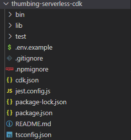
    <div align="center" style="font-weight: bold; margin-bottom:12px; padding-top:0px">Fig 1.0: Bootstraping the cdk lib</div>

- Adding a CDK Stack class
    * To create an CDK stack in our cloud formation environment, we need too create a class in the lib folder to be deployed. We add the necessary AWS tools and permissions to be setup in the formation we want to use. The full lib code can be found [here](https://github.com/MannyNe/AWS-bootcamp/tree/week-8/thumbing-serverless-cdk). After that, we synthesised the cloudformation config file to see if it is correct. The command I used was:
    ```sh
        cdk synth
    ```
    The image below shows a successful run of the command:

    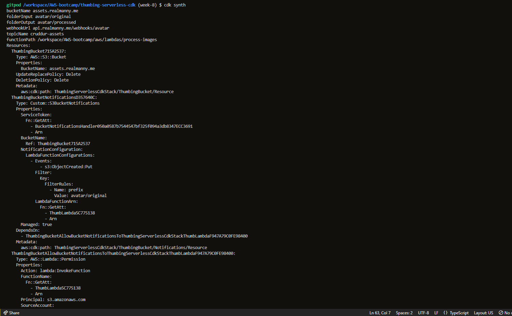
    <div align="center" style="font-weight: bold; margin-bottom:12px; padding-top:0px">Fig 1.1: CloudFormation Config</div>

    After synthesising the cloudformation config file, we bootstraped the cdk toolkit stack to help us use the cdk library in our AWS account. The command I used was:
    ```sh
        cdk bootstrap "aws://$AWS_ACCOUNT_ID/$AWS_DEFAULT_REGION"
    ```
    A successful run of the command will look like this:
    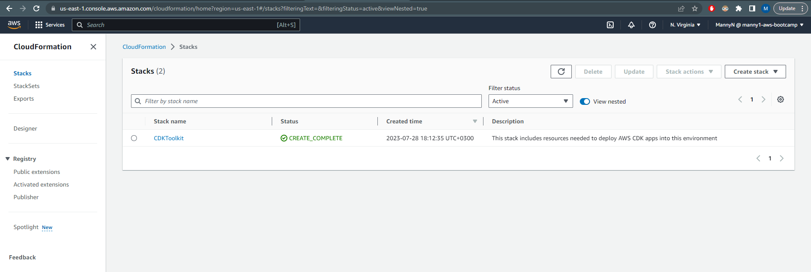
    <div align="center" style="font-weight: bold; margin-bottom:12px; padding-top:0px">Fig 1.2: CDK Bootstrap</div>

    After bootstraping the cdk library, we deployed the thumbing stack to our AWS account. The command I used was:

    ```sh
        cdk deploy
    ```

    A successful run of these commands will look like this in the terminal:
    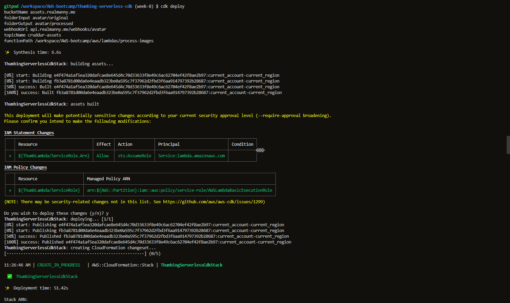
    <div align="center" style="font-weight: bold; margin-bottom:12px; padding-top:0px">Fig 1.3: CDK Deploy</div>

    In the AWS Cloudformation Console:
    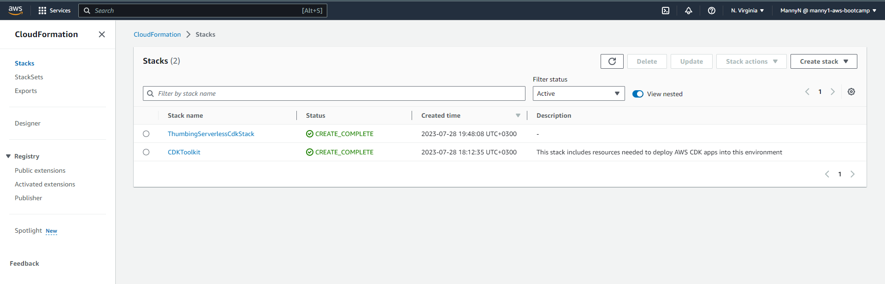
    <div align="center" style="font-weight: bold; margin-bottom:12px; padding-top:0px">Fig 1.4: Cloudformation Console</div>

    Checking if everything went well after multiple updates in events:
    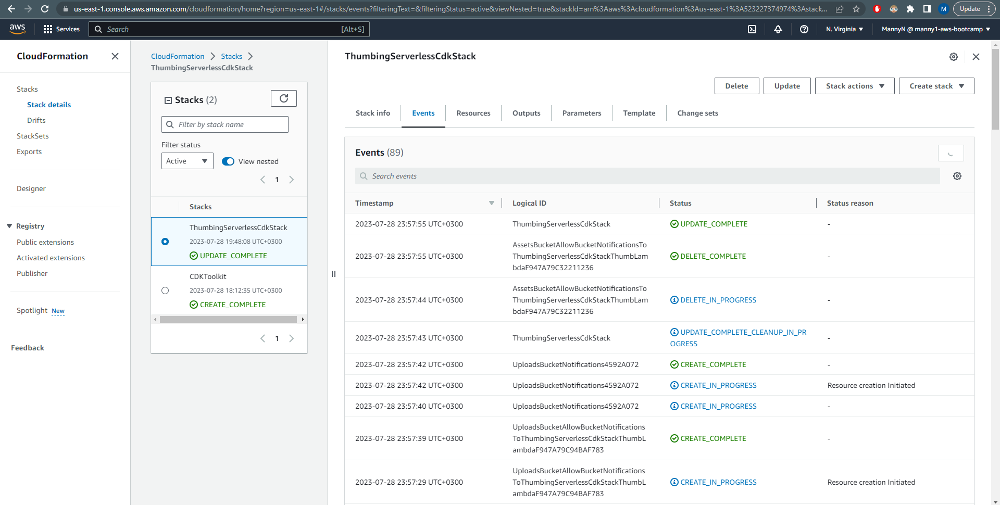
    <div align="center" style="font-weight: bold; margin-bottom:12px; padding-top:0px">Fig 1.5: Thumbing Events</div>

    After this formation was created, there were lambdas that get deployed to the cloudformation stack. The image below shows the lambdas that were deployed:
    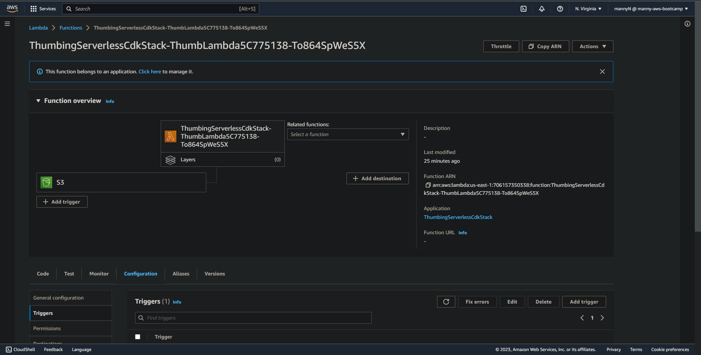
    <div align="center" style="font-weight: bold; margin-bottom:12px; padding-top:0px">Fig 1.6: Thumbing Lambda</div>

    After the checking process, we have a stack that houses our lambdas that process our images for us. It takes an image thendecreases the size to a thumb including the dimenstions of the picture. More on this on the next section.

-----------------------

### Serving Avatars via CloudFront
- To serve avatars via cloud fromt, we used to the AWS console to create a cloudfront distribution. We used the s3 bucket we created in the previous section as the origin for the cloudfront distribution. We also added a custom domain name to the cloudfront distribution. The image below shows the cloudfront distribution:

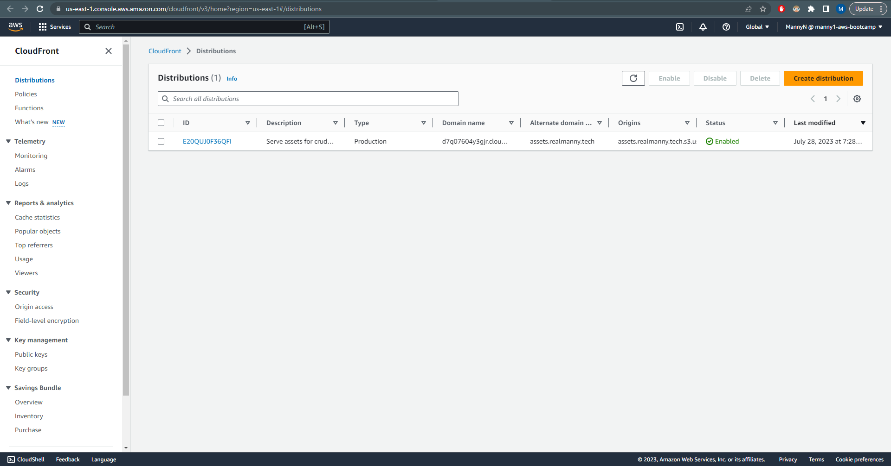
<div align="center" style="font-weight: bold; margin-bottom:12px; padding-top:0px">Fig 2.0: Cloudfront Distribution</div>

- After creating the distribution, we updated our thumbing stack to include an upload bucket as well as the assets bucket which holds the processed images. The image below shows the updated buckets:

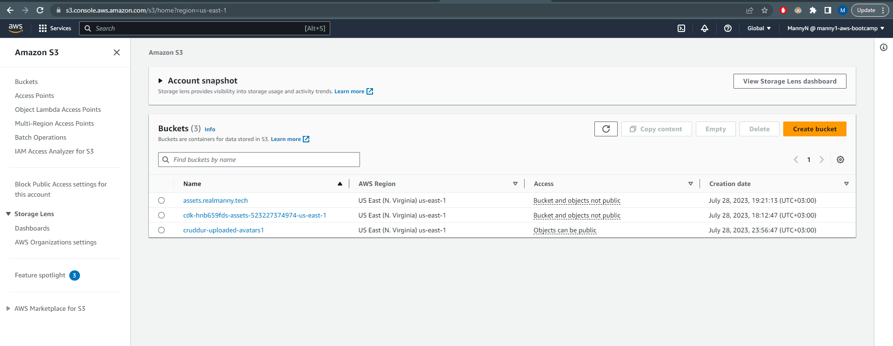
<div align="center" style="font-weight: bold; margin-bottom:12px; padding-top:0px">Fig 2.1: Buckets</div>

- By using the script we created in the previous section, we added a new image to the uploads bucket. If the processing lambda works correct, it should create a new image in the assets bucket. The image below shows the new image in the assets bucket:

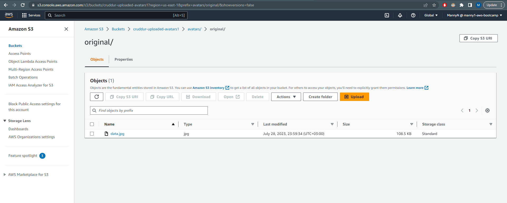
<div align="center" style="font-weight: bold; margin-bottom:12px; padding-top:0px">Fig 2.2: Unprocessed Image</div>

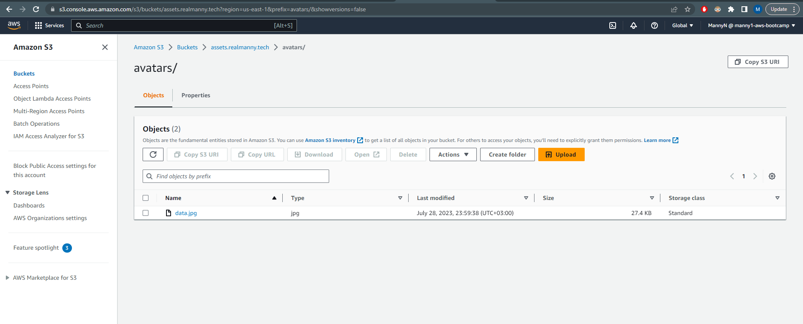
<div align="center" style="font-weight: bold; margin-bottom:12px; padding-top:0px">Fig 2.3: Processed Image</div>

As you can see from above, the assets bucket got updated and the image was processed to have a lower size and dimensions.

-----------------------

### Implementing Users Profile Page.
- After creating the cloudfront distribution and the buckets needed to store the images, we updated the existing profile page that will be used to display the user's profile, as well as the form needed to update those said profiles. The page will be used to display the user's profile picture, name, crud, and bio.
    - The first thing we added was the `show.sql` file which is used to query the database to get the user's information. The file can be found [here](https://github.com/MannyNe/AWS-bootcamp/blob/week-8/backend-flask/db/sql/users/show.sql). After that, we modified the `user_activities.py` file to include the new route that will be used to display the user's profile. The file can be found [here](https://github.com/MannyNe/AWS-bootcamp/blob/week-8/backend-flask/services/user_activities.py).
    - Then, we modified the frontend to include those changes made to the backend.The first thing we created was the `EditProfileButton.js` and `ProfileHeading.js`, which will be displayed on the profile page. This will be the button which will take us to the profile page. After this and other additional updates, we updated the `UserFeedPage.js`, `HomeFeedPage.js` files on the frontend to accomodate those changes. The profile page after the changes are shown below:
    
    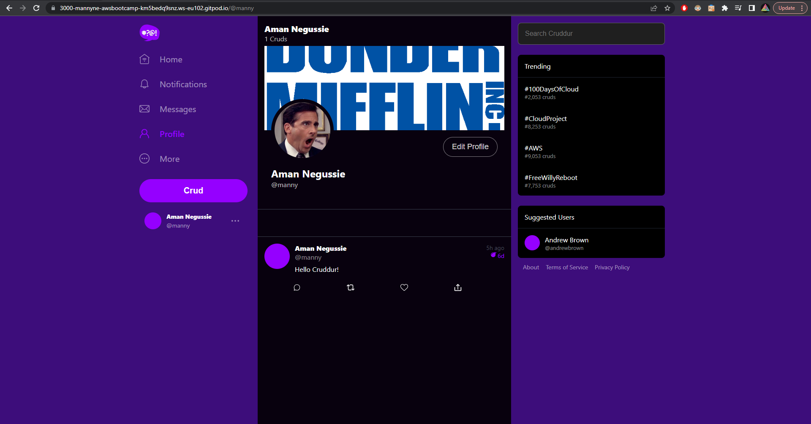
<div align="center" style="font-weight: bold; margin-bottom:12px; padding-top:0px">Fig 3.0: Profile Page</div>

-----------------------

### Implementing Backend Migrations and Page and Form.
- Before implementing the backend migrations, we updated the frontend profile form. The form, `ProfileForm.js`, will be used to update the user's profile. After this, we created an `update.sql` file which will be used to update the user's profile in the database. After this, we added a file called `update_profile.py` file to include the new route that will be used to update the user's profile. After this, we updated the `UserFeedPage.js` file on the frontend to accomodate those changes. So the steps we followed looks like this:

    - First, we created the `ProfileForm.js` file, which will be used to update the user's profile. The file can be found [here](https://github.com/MannyNe/AWS-bootcamp/blob/week-8/frontend-react-js/src/components/ProfileForm.js). After doing that, we updated the `UsersFeedPage.js` file to include the form.
    - Then, we created the `update_profile.py` file which will be used to update the user's profile in the database. The file can be found [here](https://github.com/MannyNe/AWS-bootcamp/blob/week-8/backend-flask/services/update_profile.py). This file uses the `update.sql` file which will be used to update the user's profile in the database. The file can be found [here](https://github.com/MannyNe/AWS-bootcamp/blob/week-8/backend-flask/db/sql/users/update.sql).
    - But before we update the database, we'll need a new column called bio so that the user can add a bio. We didn't include thos column in the previous schema for the database. So we created our own generator script which generates up nad down migrations. The file can be found [here](https://github.com/MannyNe/AWS-bootcamp/blob/week-8/bin/generate/migration). 

After tweaking these changes, we were able to update the user bio from the frontend using the form we created. The image below shows the updated bio in the profile page:


<div align="center" style="font-weight: bold; margin-bottom:12px; padding-top:0px">Fig 4.0: Profile Page Updated Bio</div>

-----------------------

### Presigned URL generation via Ruby Lambda.
- This and the following processes were one of the most challenging processes I've gone through for this week because of the amount of errors faced. I had to debug things on my own to fix some of the issues I was facing. I was glad I faced the errors becuase it tought me a lot about Cloudwatch logs. The followinf shows the process we went through to upload images from the client side.

    - First, we created a lambda function that will be used to generate a presigned url. The lambda function will be used to generate a presigned url that will be used to upload images to the s3 bucket. The lambda function uses the `function.rb` file which will be used to generate a presigned url. The file can be found [here](https://github.com/MannyNe/AWS-bootcamp/blob/week-8/aws/lambdas/cruddur-upload-avatar/function.rb). We attached a policy for us to generate the presigned key. The policy can be found [here](https://github.com/MannyNe/AWS-bootcamp/blob/week-8/aws/policies/s3-upload-avatar-presigned-url-policy.json). The image below shows the lambda function:
    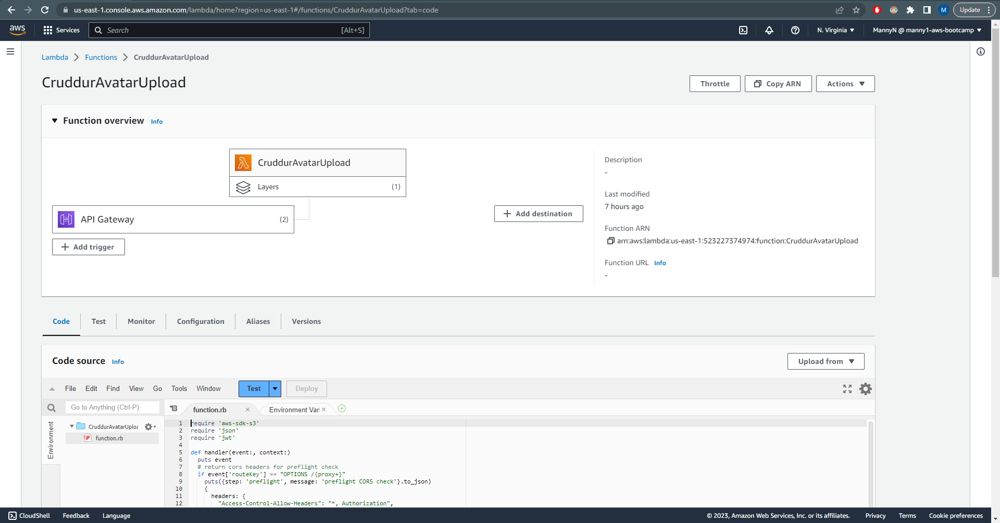
    <div align="center" style="font-weight: bold; margin-bottom:12px; padding-top:0px">Fig 5.0: PSK Lambda</div>

    - Second, we created the lambda authorizer which will be used to authorize the user to upload images to the s3 bucket. The lambda authorizer uses the `index.js` file from the `lambda-authorizer` folder which will be used to authorize the user to upload images to the s3 bucket. This step had some codetraps that weren't part of the steps in the video, which I had to add. So in the step of adding fetching the jwt, we were adding the 'bearer' part to be the part of verification. That was wrong. So I had to slice that part from the JWT to make it work. The other code trap was to add the environment variables to the lambda.  The cloud watch logs helped in this process. The lambda-authorizer lambda can be found [here](https://github.com/MannyNe/AWS-bootcamp/tree/week-8/aws/lambdas/lambda-authorizer). The update in lambda looks like this:
    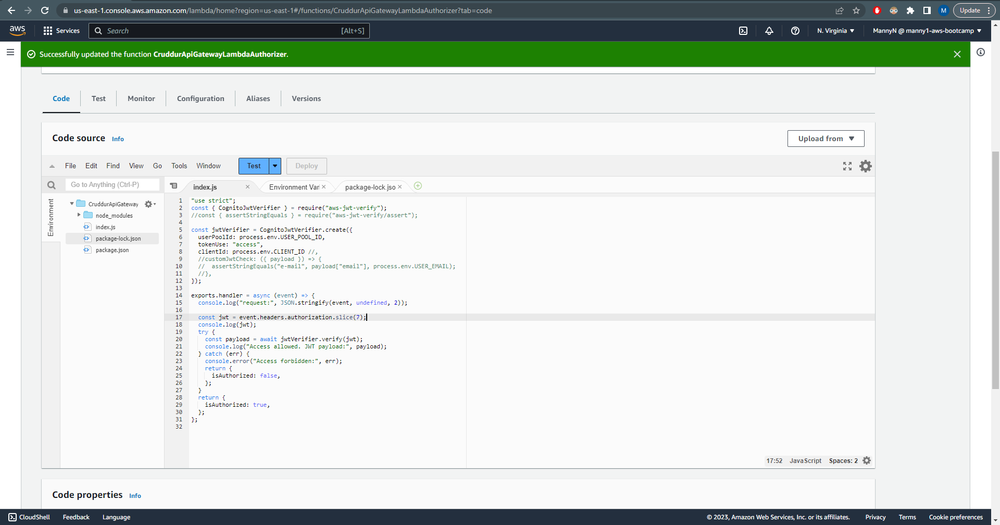
    <div align="center" style="font-weight: bold; margin-bottom:12px; padding-top:0px">Fig 5.1: PSK Lambda</div>

-----------------------

### Creating HTTP API Gateway with Lambda Authorizer.
- After creating the Authorizer locally, we zipped the file and uploaded the file to AWS Lambda. The image below shows the lambda authorizer:

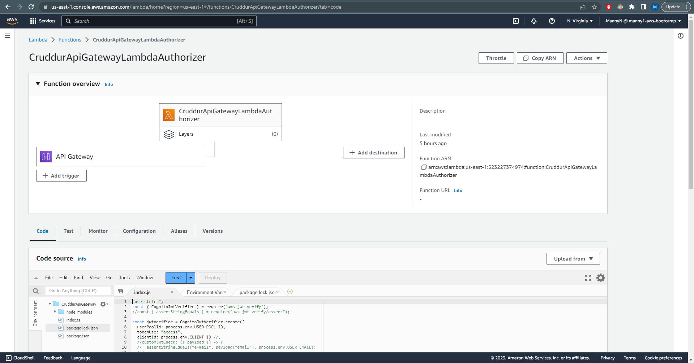
<div align="center" style="font-weight: bold; margin-bottom:12px; padding-top:0px">Fig 6.0: Lambda Authorizer</div>

- After creating the lambda authorizer, we created the HTTP API Gateway. The HTTP API Gateway uses the lambda authorizer, in conjuction with the avatar upload lambda. The steps taken look like the following:
    - First, we created the HTTP API Gateway. The HTTP API Gateway uses the uploader lambda. We use the `POST` request route to upload images. After creating that route, we attach an authorizer to that route. The authorizer is the lambda authorizer we created.
    - Second, we add an `{+proxy}` route so that we can combat the CORS issues we were facing while trying to upload images. We attached integrations to this route, but not authorizers. The image below shows the HTTP API Gateway:
    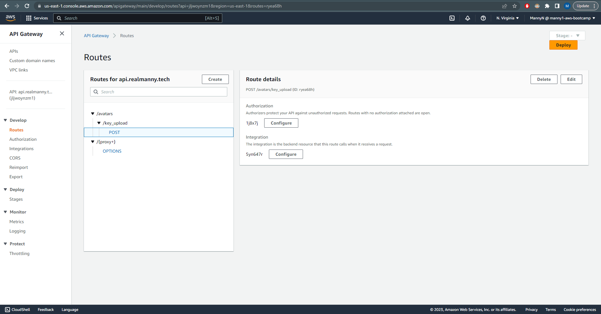
    <div align="center" style="font-weight: bold; margin-bottom:12px; padding-top:0px">Fig 6.1: HTTP API Gateway Details</div>

-----------------------

### Creating JWT Lambda Layer.
- After updating the cors issues and all, we create a lambda layer to import the jwt library for the ruby lambda. We created a script to generate and upload the layer to aws. The file can be found [here](https://github.com/MannyNe/AWS-bootcamp/blob/week-8/bin/lambda-layers/ruby-jwt). We then attached the layer to the ruby lambda.

-----------------------

### Rendering Avatars in App via CloudFront.
- After creating the lambda layer, renderring was a matter of updating our frontend code to display the images. We updated the `ProfileAvatar.js` file to display the images pulled from the distribution. Becuase we changed the filename to be our UUID, we had to update the route to attach the props to the component. The image below shows the updated avatar after uploading to the bucket:

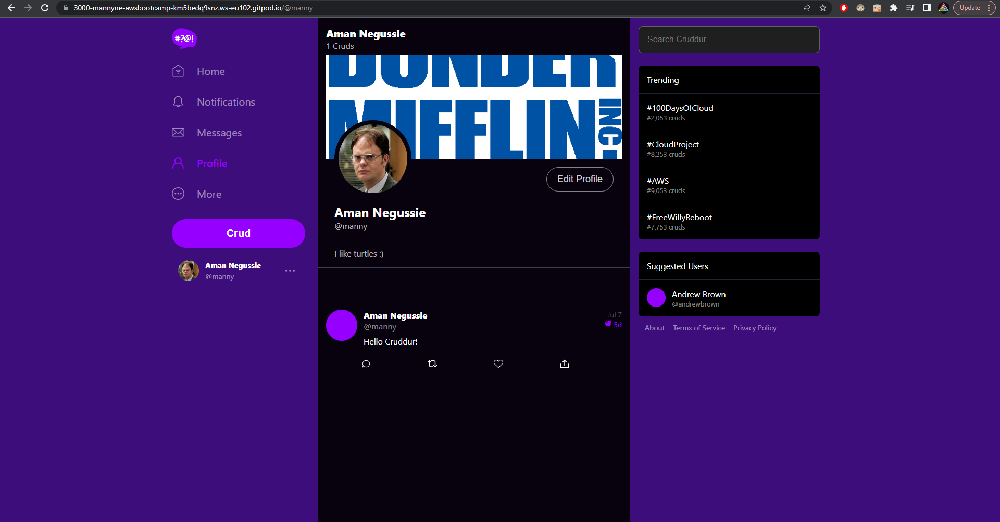
<div align="center" style="font-weight: bold; margin-bottom:12px; padding-top:0px">Fig 7.0: Profile Page Updated Avatar</div>