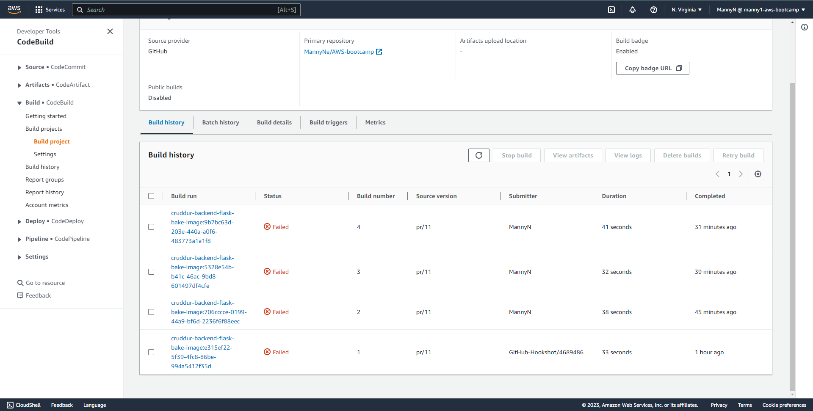
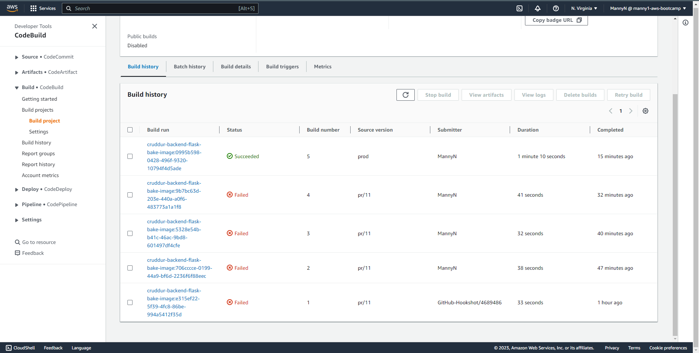
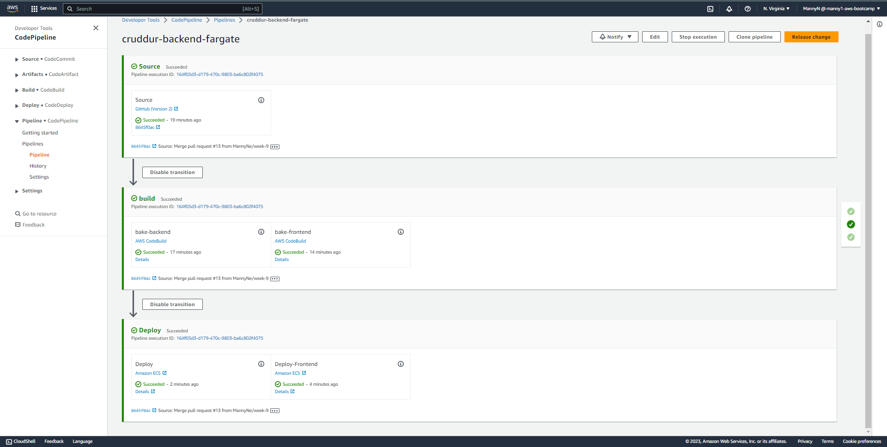
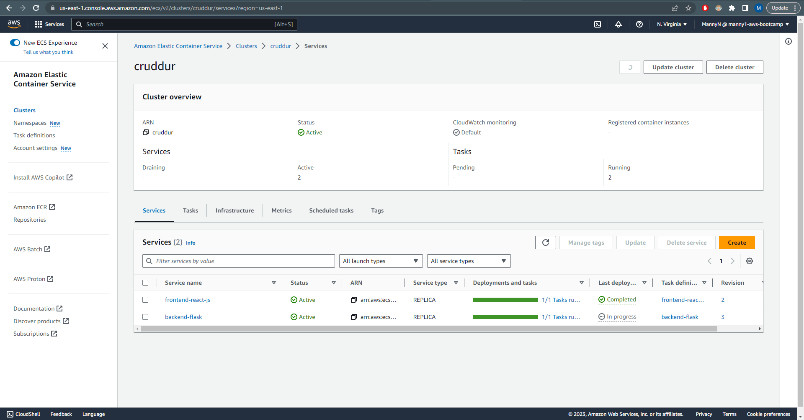
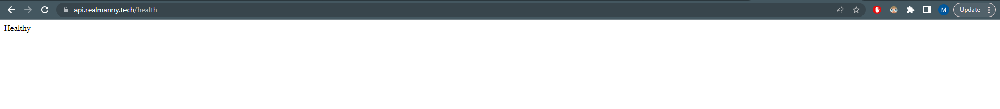
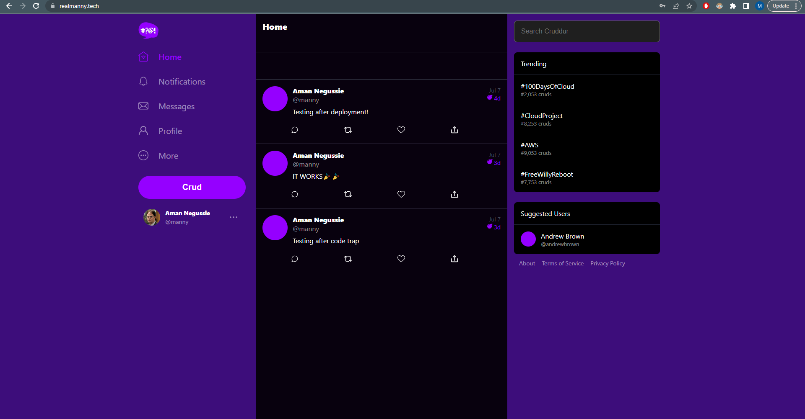

# Week 9 — CI/CD with CodePipeline, CodeBuild and CodeDeploy


- In this week, we learnt about processing images using lambdas, as well as using the AWS cdk tool. Some of the things we learnt include: 
    * Configure CodeBuild Project
    * Configure CodePipeline
    * Create a buildspec.yml file

## Required Homework/Tasks (class summary)
- To test if we grasped the concepts provided to us through the meeting as well as the provided videos to aid us, we were given tasks. They are:
    - [X] Creating a buildspec.yml file for both frontend and backend.
    - [X] Configuring CodeBuild Project for both frontend and backend.
    - [X] Configuring CodePipeline for both frontend and backend.

- I will describe my work and the process in the order provided above.

### Creating a buildspec.yml file.
- Creating the buildspec.yml file was quite easy. I just had to follow the instructions provided in the video. I created a file named `buildspec.yml` and added the following code to it:

- For the backend:
    ```yml
    version: 0.2
    phases:
      install:
        runtime-versions:
          docker: 20
        commands:
          - echo "cd into $CODEBUILD_SRC_DIR/frontend"
          - cd $CODEBUILD_SRC_DIR/frontend-react-js
          - aws ecr get-login-password --region $AWS_DEFAULT_REGION | docker login --username AWS --password-stdin $IMAGE_URL
      build:
        commands:
          - echo Build started on `date`
          - echo Building the Docker image...          
          - docker build --build-arg REACT_APP_BACKEND_URL="https://api.realmanny.tech" --build-arg REACT_APP_AWS_PROJECT_REGION="$AWS_DEFAULT_REGION" --build-arg  REACT_APP_AWS_COGNITO_REGION="$AWS_DEFAULT_REGION" --build-arg REACT_APP_AWS_USER_POOLS_ID="us-east-1_04jipO7kj" --build-arg REACT_APP_CLIENT_ID="1hknjjikkhfcro0qneo8er40ic"    -t frontend-react-js -f Dockerfile.prod .
          - "docker tag $REPO_NAME $IMAGE_URL/$REPO_NAME"
      post_build:
      .
      .
      .
    ```

- For the backend:
    ```yml
    version: 0.2
    phases:
      install:
        runtime-versions:
          docker: 20
        commands:
          - echo "cd into $CODEBUILD_SRC_DIR/backend"
          - cd $CODEBUILD_SRC_DIR/backend-flask
          - aws ecr get-login-password --region $AWS_DEFAULT_REGION | docker login --username AWS --password-stdin $IMAGE_URL
      build:
        commands:
          - echo Build started on `date`
          - echo Building the Docker image...          
          - docker build -t backend-flask .
          - "docker tag $REPO_NAME $IMAGE_URL/$REPO_NAME"
      post_build:
      .
      .
      .
    ```

The full code can be found [here]() for the frontend and [here]() for the backend.

- The code above is used to build the docker image and push it to the ECR repository. The code is quite self explanatory. The only thing I had to do was to change the enviromnent variables to match my own.

----------------------
### Configuring CodeBuild Project.
- This part of the homework was a bit challenging cause I faced some code traps. One of the major codetraps I faced was permission issues on the ECR policy. I had to create and attach a new inline policy to the `codebuild-cruddur-service-role` to make that work. The policy is shown below:

```json
{
    "Version": "2012-10-17",
    "Statement": [
        {
            "Sid": "ECRPolicy",
            "Effect": "Allow",
            "Action": [
                "ecr:BatchCheckLayerAvailability",
                "ecr:CompleteLayerUpload",
                "ecr:GetAuthorizationToken",
                "ecr:InitiateLayerUpload",
                "ecr:PutImage",
                "ecr:UploadLayerPart"
            ],
            "Resource": "*"
        }
    ]
}
```
- After adding this policy, it was a matter or rebuilding the file. The image below shows the before and after of the addition of policies.

    
    <div align="center" style="font-weight: bold; margin-bottom:12px; padding-top:0px">Fig 2.0: Before Adding Permission</div>

    
    <div align="center" style="font-weight: bold; margin-bottom:12px; padding-top:0px">Fig 2.1: After Adding Permission</div>

----------------------

### Configuring CodePipeline.
- This part of the homework was quite easy a well. I just had to follow the instructions provided in the video. I updated the `buildspec.yml` to change the directory to the main one because the build stage was failing because of the `imagedefinitions.json` file. After fixing/updating that and configuring the bake and deploy stages, I was able to get the pipeline to work. Configuring the pipeline for the frontend wasn't hard as we configured the source for it. It was a matter of adding a build and deploy stage. After configuring those, I was able to successfuly deploy both the frontend and backend to the ECS cluster. The image below shows the pipeline working.

    
    <div align="center" style="font-weight: bold; margin-bottom:12px; padding-top:0px">Fig 2.0: Pipeline Working</div>

    
    <div align="center" style="font-weight: bold; margin-bottom:12px; padding-top:0px">Fig 2.1: ECS console</div>

    
    <div align="center" style="font-weight: bold; margin-bottom:12px; padding-top:0px">Fig 2.2: Backend Deployment Working</div>

    
    <div align="center" style="font-weight: bold; margin-bottom:12px; padding-top:0px">Fig 2.3: Frontend Deployment Working</div>